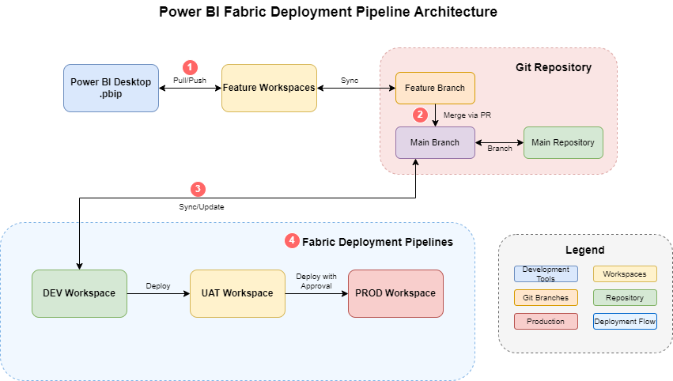

# Microsoft Fabric Git Integration & CI/CD Pipeline Reference Guide

## 📋 Table of Contents

- [📋 Table of Contents](#-table-of-contents)
- [🎯 Overview](#-overview)
- [🏗️ Architecture Overview](#️-architecture-overview)
- [🚀 Quick Start](#-quick-start)
- [📋 Prerequisites](#-prerequisites)
- [Part 1: Power BI Desktop Configuration](#part-1-power-bi-desktop-configuration)
  - [1.1 Enable Preview Features](#11-enable-preview-features)
  - [1.2 Configure Multi-Environment Parameters](#12-configure-multi-environment-parameters)
  - [1.3 Save as Power BI Project (.pbip)](#13-save-as-power-bi-project-pbip)
- [Part 2: Microsoft Fabric Environment Setup](#part-2-microsoft-fabric-environment-setup)
  - [2.1 Enable Git Integration in Fabric](#21-enable-git-integration-in-fabric)
  - [2.2 Create Workspace Structure](#22-create-workspace-structure)
  - [2.3 Connect Workspaces to Git](#23-connect-workspaces-to-git)
- [Part 3: Git Repository Configuration](#part-3-git-repository-configuration)
  - [3.1 Repository Structure](#31-repository-structure)
  - [3.2 Branch Strategy](#32-branch-strategy)
  - [3.3 Security Best Practices](#33-security-best-practices)
- [Part 4: Fabric Deployment Pipelines](#part-4-fabric-deployment-pipelines)
  - [4.1 Create Deployment Pipeline](#41-create-deployment-pipeline)
  - [4.2 Configure Three-Stage Pipeline](#42-configure-three-stage-pipeline)
  - [4.3 Set Up Parameter Rules](#43-set-up-parameter-rules)
- [Part 5: CI/CD Automation with GitHub Actions](#part-5-cicd-automation-with-github-actions)
  - [5.1 Service Principal Setup](#51-service-principal-setup)
  - [5.2 Grant Fabric Permissions](#52-grant-fabric-permissions)
  - [5.3 GitHub Configuration](#53-github-configuration)
  - [5.4 Python Deployment Script](#54-python-deployment-script)
  - [5.5 GitHub Actions Workflow](#55-github-actions-workflow)
- [Part 6: Development Workflow](#part-6-development-workflow)
  - [6.1 Feature Development Process](#61-feature-development-process)
  - [6.2 Deployment Process](#62-deployment-process)
  - [6.3 Manual Sync Requirements](#63-manual-sync-requirements)
- [Part 7: Testing & Validation](#part-7-testing--validation)
  - [7.1 End-to-End Testing](#71-end-to-end-testing)
  - [7.2 Validation Checklist](#72-validation-checklist)
- [📊 Benefits & Best Practices](#-benefits--best-practices)
- [🔧 Troubleshooting](#-troubleshooting)
- [📚 Additional Resources](#-additional-resources)

---

## 🎯 Overview

This guide provides a complete implementation of CI/CD DevOps pipelines for **Power BI Reports** in Microsoft Fabric using Git integration and deployment pipelines. The solution covers the entire lifecycle management across three environments (DEV, UAT, PROD) with automated deployments and approval processes.

**What You'll Build:**
- Complete CI/CD pipeline from development to production
- Git-based version control with feature branch workflow
- Automated deployments with approval gates
- Environment-specific parameter management
- Production-ready Power BI report lifecycle

---

## 🏗️ Architecture Overview

### Deployment Strategy: Fabric Deployment Pipelines

```
Power BI Desktop → Git Repository (Feature/Main Branches) → Fabric Deployment Pipelines

Development Flow:
1. Power BI Desktop ←→ Feature Workspaces (Pull/Push to Feature Branch)
2. Feature Branch → Main Branch (Merge via PR)
3. Main Branch → DEV Workspace (Manual Sync)
4. DEV → UAT → PROD (Deploy via Fabric Deployment Pipelines)
```

<p align="center">
   
</p>

<p align="center">
   <strong>Figure: Complete CI/CD Architecture Flow</strong>
</p>

<details>
<summary>🔍 Click to view detailed architecture flow</summary>

```
[Power BI Desktop] ←Pull/Push→ [Feature Workspaces] ←Sync→ [Feature Branch]
         ↓ (Merge PR)
[DEV Workspace] ←Manual Sync→ [Main Branch] ←Branch→ [Main Repository]
         ↓ (GitHub Actions Trigger)
[UAT Workspace] ←Deploy→ [Approval Gate]
         ↓ (Deploy with Approval)
[PROD Workspace]
```
</details>

### Key Components

| Component | Purpose | Git Integration |
|-----------|---------|-----------------|
| **Feature Workspaces** | Isolated development and testing | Connected to feature branches |
| **DEV Workspace** | Main development workspace | Connected to main branch |
| **UAT/PROD Workspaces** | Testing and production environments | Managed through deployment pipeline |
| **GitHub Actions** | Automated deployment orchestration | Triggers on main branch changes |
| **Approval Gates** | Manual review process | Environment protection rules |

---

## 🚀 Quick Start

**Estimated Setup Time:** 2-3 hours

1. **Configure Power BI Desktop** (15 minutes)
   - Enable .pbip preview features
   - Set up environment parameters

2. **Set Up Fabric Environment** (30 minutes)
   - Enable Git integration
   - Create workspace structure

3. **Configure Git Integration** (20 minutes)
   - Connect workspaces to repository
   - Set up branch strategy

4. **Create Deployment Pipeline** (30 minutes)
   - Configure three-stage pipeline
   - Set up parameter rules

5. **Implement CI/CD Automation** (45 minutes)
   - Create service principal
   - Configure GitHub Actions

6. **Test Complete Workflow** (30 minutes)
   - End-to-end validation
   - Troubleshoot issues

---

## 📋 Prerequisites

### Required Access & Permissions
- ✅ Microsoft Fabric Premium or Trial capacity
- ✅ Power BI Desktop (Latest Version)
- ✅ GitHub repository or Azure DevOps access
- ✅ Admin access to Fabric workspaces
- ✅ Azure Active Directory permissions (for service principal creation)

### Technical Requirements
- ✅ Understanding of Git concepts (branches, commits, pull requests)
- ✅ Basic knowledge of Power BI report development
- ✅ Familiarity with CI/CD concepts
- ✅ Azure CLI or Azure Portal access

### Capacity Requirements
- ✅ **Fabric Capacity**: Required for Git integration and deployment pipelines
- ✅ **Active Capacity**: All workspaces must be on active Fabric capacity
- ✅ **Cross-Environment**: DEV, UAT, and PROD workspaces can be on different capacities

---

## Part 1: Power BI Desktop Configuration

### 1.1 Enable Preview Features

Power BI Desktop must be configured to support the new .pbip format for seamless Fabric integration.

**Steps:**
1. Open **Power BI Desktop**
2. Navigate to **File → Options and Settings → Options**
3. Go to **Preview Features** section
4. Enable: **"Power BI Project (.pbip) save option"**

<p align="center">
   
</p>
<p align="center">
   <strong>Figure: Enable Power BI Project (.pbip) Format</strong>
</p>

> **⚠️ Important Notes:**
> - **TMDL and PBIR options**: Visible but should remain **unchecked**
> - **Restart required**: Restart Power BI Desktop after enabling
> - **Compatibility**: .pbip format ensures deployment pipeline compatibility

### 1.2 Configure Multi-Environment Parameters

Configure parameters in **Power Query Editor** to support multiple environments.

**Step 1: Open Power Query Editor**
1. Click **"Transform Data"** in Power BI Desktop
2. Navigate to **Home → Manage Parameters**

**Step 2: Create Environment Parameter**
```
Name: Environment
Description: Current deployment environment (DEV, UAT, or PROD)
Required: ✅ Checked
Type: Text
Suggested Values: List of values
  - DEV
  - UAT
  - PROD
Current Value: DEV
```

**Step 3: Create Server Parameter**
```
Name: SrvName
Description: Database server name based on environment
Required: ✅ Checked
Type: Text
Suggested Values: Any value
Current Value: dev-server-id.database.fabric.microsoft.com
```

**Step 4: Create Database Parameter**
```
Name: DbName
Description: Database name based on environment
Required: ✅ Checked
Type: Text
Suggested Values: Any value
Current Value: adventureworks-dev-workspace-id
```

<p align="center">
   
</p>
<p align="center">
   <strong>Figure: Environment Parameter Configuration</strong>
</p>

**Step 5: Apply Parameters to Data Source**
1. Navigate to your data source query
2. Right-click on **Source step** → **Edit Settings**
3. Configure connection:
   - **Server:** Select `SrvName` parameter
   - **Database:** Select `DbName` parameter
   - **Authentication:** Microsoft account or Organizational account

<p align="center">
   
</p>
<p align="center">
   <strong>Figure: Apply Parameters to Data Source</strong>
</p>

### 1.3 Save as Power BI Project (.pbip)

**Naming Convention:**
```
[ProjectName]_[ReportType]_[Version].pbip
Example: SalesAnalytics_Dashboard_v1.0.pbip
```

**Folder Structure After Save:**
<p align="center">
   
</p>
<p align="center">
   <strong>Figure: Power BI Project Folder Structure</strong>
</p>

---

## Part 2: Microsoft Fabric Environment Setup

### 2.1 Enable Git Integration in Fabric

#### Tenant Settings Configuration

**Option 1: Tenant-Wide Settings**
1. Navigate to **Microsoft Fabric Admin Portal**
2. Go to **Tenant Settings**
3. Enable **"Users can synchronize workspace items with their Git repositories"**

**Option 2: Capacity-Specific Settings (Recommended)**
1. Navigate to **Capacity Settings**
2. Select your Fabric capacity
3. Go to **Delegated Tenant Settings**
4. Configure Git integration settings

<p align="center">
   
</p>
<p align="center">
   <strong>Figure: Tenant Git Integration Settings</strong>
</p>

**Required Settings Configuration:**
```
✅ Users can synchronize workspace items with their Git repositories
✅ Users can sync workspace items with GitHub repositories  
✅ Users can export items to Git repositories in other geographical locations
✅ Users can export workspace items with applied sensitivity labels to Git repositories
✅ Users can create Fabric items
```

<p align="center">
   
</p>
<p align="center">
   <strong>Figure: Capacity Git Integration Settings</strong>
</p>

#### Workspace Creation Settings
**Tenant-Level Configuration Required:**
<p align="center">
   
</p>
<p align="center">
   <strong>Figure: Workspace Creation Settings</strong>
</p>

### 2.2 Create Workspace Structure

Create workspaces following this naming convention:

<p align="center">
   
</p>
<p align="center">
   <strong>Figure: Workspace Structure Overview</strong>
</p>

**Workspace Configuration:**

| Workspace Name | Purpose | Git Connection | Capacity Required |
|----------------|---------|----------------|-------------------|
| `FABRIC-CATALYST-GH-FEATURE` | Feature development | Feature branches | ✅ Yes |
| `FABRIC-CATALYST-GH-DEV` | Main development | Main branch | ✅ Yes |
| `FABRIC-CATALYST-GH-STG` | UAT testing | Pipeline managed | ✅ Yes |
| `FABRIC-CATALYST-GH-PROD` | Production | Pipeline managed | ✅ Yes |

### 2.3 Connect Workspaces to Git

#### Connect DEV Workspace to Main Branch

1. Navigate to **DEV Workspace Settings**
2. Select **Git Integration** tab
3. Click **Connect to Git**

**Configuration:**
```
Git provider: GitHub
Organization: [your-github-org]
Repository: [your-repo-name]
Branch: main
Folder: / (root)
```

<p align="center">
   
</p>
<p align="center">
   <strong>Figure: DEV Workspace Git Integration</strong>
</p>

#### Connect Feature Workspace to Feature Branch

1. Navigate to **Feature Workspace Settings**
2. Select **Git Integration** tab
3. Click **Connect to Git**

**Configuration:**
```
Git provider: GitHub
Organization: [your-github-org]
Repository: [your-repo-name]
Branch: feature/[feature-name]
Folder: / (root)
```

<p align="center">
   
</p>
<p align="center">
   <strong>Figure: Feature Workspace Git Integration</strong>
</p>

---

## Part 3: Git Repository Configuration

### 3.1 Repository Structure

**Recommended Structure:**
```
PBIP_Fabric_Reference_Guide/
├── .github/
│   └── workflows/
│       └── fabric-deployment.yml     # CI/CD workflow
├── scripts/
│   └── deploy_all.py                # Deployment script
├── fabric/
│   └── workspace/                   # Synced .pbip files
│       ├── [ReportName].Report/
│       ├── [ReportName].SemanticModel/
│       └── README.md
├── docs/
│   └── deployment-guide.md         # Documentation
├── .gitignore                      # Security configurations
└── README.md                       # This guide
```

### 3.2 Branch Strategy

**Branch Mapping:**
```
Git Branch                    ↔ Fabric Workspace
─────────────────────────────────────────────────
main                         ↔ FABRIC-CATALYST-GH-DEV
feature/[feature-name]       ↔ FABRIC-CATALYST-GH-FEATURE
```

**Development Workflow:**
1. **Feature Development:** `feature/[name]` → Feature Workspace
2. **Integration:** Feature branch → `main` branch (via PR)
3. **Deployment:** `main` branch → DEV → UAT → PROD

### 3.3 Security Best Practices

**❌ Never Commit These to Git:**
- Database connection strings
- Server URLs or endpoints
- Workspace names or IDs
- Authentication tokens or passwords
- Capacity identifiers
- Environment-specific configuration

**✅ Secure Alternatives:**

**Option 1: Template Configuration**
```json
// config/template-config.json
{
  "environment": "TEMPLATE",
  "workspace": "PROJECT-NAME-{ENVIRONMENT}",
  "dataSourceSettings": {
    "serverName": "{SERVER-ENDPOINT-PLACEHOLDER}",
    "databaseName": "{DATABASE-NAME-PLACEHOLDER}"
  }
}
```

**Option 2: Fabric-Native Parameter Management**
- Configure parameter rules in deployment pipeline
- All sensitive values managed within Fabric
- No configuration files needed in Git

> **📝 This Guide Uses:** Option 2 (Fabric-Native) for maximum security

---

## Part 4: Fabric Deployment Pipelines

### 4.1 Create Deployment Pipeline

1. Navigate to **Deployment Pipelines** in Microsoft Fabric
2. Click **Create Pipeline**

**Pipeline Configuration:**
```
Pipeline Name: PowerBI-Reports-Lifecycle
Description: Automated deployment from DEV to UAT to PROD
Pipeline Type: Standard (3-stage pipeline)
```

### 4.2 Configure Three-Stage Pipeline

**Stage Configuration:**

| Stage | Workspace | Source | Role |
|-------|-----------|--------|------|
| **Development** | `FABRIC-CATALYST-GH-DEV` | Git main branch | Source workspace |
| **Test** | `FABRIC-CATALYST-GH-STG` | Deployed from DEV | UAT environment |
| **Production** | `FABRIC-CATALYST-GH-PROD` | Deployed from UAT | Live environment |

<p align="center">
   
</p>
<p align="center">
   <strong>Figure: Three-Stage Deployment Pipeline</strong>
</p>

### 4.3 Set Up Parameter Rules

> **⚠️ Critical:** Parameter rules can only be configured **AFTER** the first deployment

**Step 1: Initial Deployment (Without Rules)**
1. Deploy from DEV → UAT without parameter rules
2. Verify successful deployment
3. Items will initially use DEV parameters (expected)

**Step 2: Configure Parameter Rules (After First Deployment)**

**UAT Stage Parameter Rules:**
```
Parameter: Environment
DEV Value: DEV → UAT Value: UAT

Parameter: SrvName  
DEV Value: dev-server-endpoint → UAT Value: uat-server-endpoint

Parameter: DbName
DEV Value: dev-database-id → UAT Value: uat-database-id
```

**PROD Stage Parameter Rules:**
```
Parameter: Environment
UAT Value: UAT → PROD Value: PROD

Parameter: SrvName  
UAT Value: uat-server-endpoint → PROD Value: prod-server-endpoint

Parameter: DbName
UAT Value: uat-database-id → PROD Value: prod-database-id
```

<p align="center">
   
</p>
<p align="center">
   <strong>Figure: Parameter Rules Configuration</strong>
</p>

---

## Part 5: CI/CD Automation with GitHub Actions

### 5.1 Service Principal Setup

#### Create Azure Service Principal

**Option 1: Azure CLI**
```bash
az ad sp create-for-rbac --name "fabric-cicd-sp" --role contributor --scopes /subscriptions/{subscription-id}
```

**Option 2: Azure Portal**
1. Go to **Microsoft Entra ID → App registrations**
2. Click **New registration**
3. Name: `fabric-cicd-sp`
4. Register the application

**Configure API Permissions:**
1. Go to **API permissions**
2. Add **Power BI Service** permissions:
   - `Microsoft Graph.Group.Read.All`
   - `Microsoft Graph.User.Read`
3. Grant admin consent

**Create Client Secret:**
1. Go to **Certificates & secrets**
2. Create new client secret
3. Copy the secret value (save immediately)

**Save These Values:**
```
Tenant ID: [from Azure AD Overview]
Client ID: [from App registration Overview]
Client Secret: [the secret value]
```

### 5.2 Grant Fabric Permissions

#### Add Service Principal to Workspaces

**For Each Workspace (DEV, UAT, PROD):**
1. Go to workspace **Manage Access**
2. Add service principal: `fabric-cicd-sp`
3. Assign role: **Admin**

<p align="center">
   
</p>
<p align="center">
   <strong>Figure: Workspace Access Management</strong>
</p>

#### Add Service Principal to Deployment Pipeline

1. Go to deployment pipeline **Manage Users**
2. Add service principal: `fabric-cicd-sp`
3. Assign role: **Admin**

<p align="center">
   
</p>
<p align="center">
   <strong>Figure: Pipeline Access Management</strong>
</p>

### 5.3 GitHub Configuration

#### Repository Secrets

Go to `Settings → Secrets and variables → Actions`:

```bash
# Azure/Fabric Authentication
FABRIC_TENANT_ID=your-azure-tenant-id
FABRIC_CLIENT_ID=your-service-principal-client-id
FABRIC_CLIENT_SECRET=your-service-principal-client-secret

# Fabric Configuration
FABRIC_PIPELINE_NAME=PowerBI-Reports-Lifecycle

# Optional: Workspace IDs
DEV_WORKSPACE_ID=your-dev-workspace-id
UAT_WORKSPACE_ID=your-uat-workspace-id
PROD_WORKSPACE_ID=your-prod-workspace-id
```

#### Environment Protection Rules

**Create Environments:**
1. Go to `Settings → Environments`
2. Create: **UAT** and **PROD** environments

**UAT Environment Configuration:**
```
Required reviewers: ✅ Add reviewers
Prevent self-review: ✅ Optional
Wait timer: 0 minutes (optional)
Deployment branches: main branch only
```

**PROD Environment Configuration:**
```
Required reviewers: ✅ Senior reviewers required
Prevent self-review: ✅ Enabled
Wait timer: 5-10 minutes (cooling period)
Deployment branches: main branch only
```

### 5.4 Python Deployment Script

Create the deployment script that the GitHub Actions workflow calls.

#### Create `scripts/deploy_all.py`

This Python script uses the Microsoft Fabric REST API to trigger deployment pipeline operations:

```python
#!/usr/bin/env python3
"""
Microsoft Fabric Deployment Pipeline Script
Automates deployment between pipeline stages using Fabric REST API
"""

import os
import sys
import time
import json
import requests
from typing import Optional, Dict, Any

class FabricDeployment:
    def __init__(self, tenant_id: str, app_id: str, client_secret: str):
        self.tenant_id = tenant_id
        self.app_id = app_id
        self.client_secret = client_secret
        self.access_token = None
        self.base_url = "https://api.fabric.microsoft.com/v1"
        
    def get_access_token(self) -> bool:
        """
        Get OAuth2 access token using client credentials flow for Fabric API
        """
        token_url = f"https://login.microsoftonline.com/{self.tenant_id}/oauth2/v2.0/token"
        
        token_data = {
            'grant_type': 'client_credentials',
            'client_id': self.app_id,
            'client_secret': self.client_secret,
            'scope': 'https://api.fabric.microsoft.com/.default'
        }
        
        try:
            response = requests.post(token_url, data=token_data)
            response.raise_for_status()
            
            token_response = response.json()
            self.access_token = token_response.get('access_token')
            
            if self.access_token:
                print("✅ Successfully authenticated with Microsoft Fabric service")
                return True
            else:
                print("❌ Failed to obtain access token")
                return False
                
        except requests.exceptions.RequestException as e:
            print(f"❌ Error during authentication: {e}")
            return False
    
    def get_headers(self) -> Dict[str, str]:
        """
        Get HTTP headers with authorization token
        """
        return {
            'Authorization': f'Bearer {self.access_token}',
            'Content-Type': 'application/json'
        }
    
    def get_deployment_pipelines(self) -> Optional[list]:
        """
        Get all deployment pipelines using Fabric API
        """
        url = f"{self.base_url}/deploymentPipelines"
        
        try:
            response = requests.get(url, headers=self.get_headers())
            response.raise_for_status()
            
            pipelines_data = response.json()
            return pipelines_data.get('value', [])
            
        except requests.exceptions.RequestException as e:
            print(f"❌ Error fetching deployment pipelines: {e}")
            return None
    
    def get_pipeline_stages(self, pipeline_id: str) -> Optional[list]:
        """
        Get deployment pipeline stages using Fabric API
        """
        url = f"{self.base_url}/deploymentPipelines/{pipeline_id}/stages"
        
        try:
            response = requests.get(url, headers=self.get_headers())
            response.raise_for_status()
            
            stages_data = response.json()
            return stages_data.get('value', [])
            
        except requests.exceptions.RequestException as e:
            print(f"❌ Error fetching pipeline stages: {e}")
            return None
    
    def find_pipeline_by_name(self, pipeline_name: str) -> Optional[Dict[str, Any]]:
        """
        Find a deployment pipeline by its display name
        """
        pipelines = self.get_deployment_pipelines()
        
        if pipelines is None:
            return None
            
        for pipeline in pipelines:
            if pipeline.get('displayName') == pipeline_name:
                print(f"✅ Found pipeline: {pipeline_name}")
                return pipeline
                
        print(f"❌ Pipeline '{pipeline_name}' not found")
        return None
    
    def deploy_stage_content(self, pipeline_id: str, source_stage_order: int) -> bool:
        """
        Deploy content from source stage to target stage using Fabric API
        """
        # Get pipeline stages to determine source and target stage IDs
        stages = self.get_pipeline_stages(pipeline_id)
        if not stages:
            print("❌ Failed to retrieve pipeline stages")
            return False
        
        # Sort stages by order to find source and target
        sorted_stages = sorted(stages, key=lambda x: x.get('order', 0))
        
        if source_stage_order >= len(sorted_stages) - 1:
            print(f"❌ Invalid source stage order: {source_stage_order}. Cannot deploy from the last stage.")
            return False
        
        source_stage = sorted_stages[source_stage_order]
        target_stage = sorted_stages[source_stage_order + 1]
        
        source_stage_id = source_stage.get('id')
        target_stage_id = target_stage.get('id')
        
        print(f"🚀 Deploying from '{source_stage.get('displayName')}' to '{target_stage.get('displayName')}'")
        
        url = f"{self.base_url}/deploymentPipelines/{pipeline_id}/deploy"
        
        deploy_body = {
            "sourceStageId": source_stage_id,
            "targetStageId": target_stage_id,
            "note": f"Automated deployment from GitHub Actions - Stage {source_stage_order}",
            "options": {
                "allowCreateArtifact": True,
                "allowOverwriteArtifact": True
            }
        }
        
        try:
            response = requests.post(
                url, 
                headers=self.get_headers(), 
                json=deploy_body
            )
            response.raise_for_status()
            
            if response.status_code == 202:
                # Long running operation
                operation_location = response.headers.get('Location')
                if operation_location:
                    operation_id = operation_location.split('/')[-1]
                    print(f"📋 Operation ID: {operation_id}")
                    return self.wait_for_operation(pipeline_id, operation_id)
                else:
                    print("⚠️ Deployment started but no operation ID found")
                    return True
            else:
                deploy_result = response.json()
                print(f"✅ Deployment completed: {deploy_result}")
                return True
                
        except requests.exceptions.RequestException as e:
            print(f"❌ Error during deployment: {e}")
            if hasattr(e, 'response') and e.response is not None:
                try:
                    error_detail = e.response.json()
                    print(f"📄 Error details: {json.dumps(error_detail, indent=2)}")
                except:
                    print(f"📄 Error response: {e.response.text}")
            return False
    
    def wait_for_operation(self, pipeline_id: str, operation_id: str) -> bool:
        """
        Wait for the deployment operation to complete using Fabric API
        """
        url = f"{self.base_url}/operations/{operation_id}"
        
        max_attempts = 240  # Maximum 20 minutes (240 * 5 seconds)
        attempts = 0
        
        while attempts < max_attempts:
            try:
                response = requests.get(url, headers=self.get_headers())
                response.raise_for_status()
                
                operation = response.json()
                status = operation.get('status', 'Unknown')
                
                print(f"📊 Operation Status: {status} (Attempt {attempts + 1}/{max_attempts})")
                
                if status in ['NotStarted', 'Executing', 'Running']:
                    print("⏳ Waiting for operation to complete...")
                    time.sleep(5)
                    attempts += 1
                    continue
                elif status in ['Succeeded', 'Completed']:
                    print("✅ Deployment completed successfully!")
                    return True
                else:
                    print(f"❌ Deployment failed with status: {status}")
                    if 'error' in operation:
                        print(f"📄 Error details: {json.dumps(operation['error'], indent=2)}")
                    return False
                    
            except requests.exceptions.RequestException as e:
                print(f"❌ Error checking operation status: {e}")
                return False
        
        print("⏰ Operation timed out after 20 minutes")
        return False

def main():
    """
    Main function to execute the deployment
    """
    # Get parameters from environment variables or command line arguments
    tenant_id = os.getenv('TENANT_ID')
    app_id = os.getenv('APP_ID')
    client_secret = os.getenv('CLIENT_SECRET')
    pipeline_name = os.getenv('PIPELINE_NAME')
    stage_order = int(os.getenv('STAGE_ORDER', '0'))
    
    # If not in environment variables, try command line arguments
    if not all([tenant_id, app_id, client_secret, pipeline_name]):
        if len(sys.argv) >= 5:
            tenant_id = sys.argv[1]
            app_id = sys.argv[2]
            client_secret = sys.argv[3]
            pipeline_name = sys.argv[4]
            stage_order = int(sys.argv[5]) if len(sys.argv) > 5 else 0
        else:
            print("❌ Error: Missing required parameters")
            print("Usage: python deploy_all.py [tenant_id] [app_id] [client_secret] [pipeline_name] [stage_order]")
            print("Or set environment variables: TENANT_ID, APP_ID, CLIENT_SECRET, PIPELINE_NAME, STAGE_ORDER")
            sys.exit(1)
    
    # Validate pipeline name is provided
    if not pipeline_name:
        print("❌ Error: Pipeline name is required")
        print("Set PIPELINE_NAME environment variable or provide as command line argument")
        sys.exit(1)
    
    # Display deployment configuration
    print("🚀 Starting Microsoft Fabric Deployment")
    print(f"📋 Pipeline: {pipeline_name}")
    print(f"📊 Source Stage Order: {stage_order}")
    print(f"🔐 Tenant ID: {tenant_id[:8]}...")
    print("-" * 50)
    
    # Initialize Fabric deployment client
    deployment = FabricDeployment(tenant_id, app_id, client_secret)
    
    # Authenticate
    if not deployment.get_access_token():
        print("❌ Authentication failed")
        sys.exit(1)
    
    # Find the pipeline
    pipeline = deployment.find_pipeline_by_name(pipeline_name)
    
    if not pipeline:
        print(f"❌ Pipeline with name '{pipeline_name}' was not found")
        # List available pipelines for debugging
        print("📋 Available pipelines:")
        pipelines = deployment.get_deployment_pipelines()
        if pipelines:
            for p in pipelines:
                print(f"  - {p.get('displayName', 'Unknown')}")
        sys.exit(1)
    
    pipeline_id = pipeline.get('id')
    print(f"✅ Found pipeline with ID: {pipeline_id}")
    
    # Execute deployment
    success = deployment.deploy_stage_content(pipeline_id, stage_order)
    
    if success:
        print("🎉 Deployment completed successfully!")
        sys.exit(0)
    else:
        print("💥 Deployment failed!")
        sys.exit(1)

if __name__ == "__main__":
    main()
```

#### Script Features

**Key Capabilities:**
- ✅ **Authentication:** Uses OAuth2 client credentials flow for Fabric API
- ✅ **Pipeline Discovery:** Finds deployment pipeline by name
- ✅ **Stage Management:** Automatically determines source and target stages
- ✅ **Long-Running Operations:** Monitors deployment progress with timeout
- ✅ **Error Handling:** Comprehensive error reporting and debugging
- ✅ **Flexible Input:** Supports environment variables and command-line arguments

**Usage Options:**

**Option 1: Environment Variables (Recommended for CI/CD)**
```bash
export TENANT_ID="your-tenant-id"
export APP_ID="your-app-id"
export CLIENT_SECRET="your-client-secret"
export PIPELINE_NAME="PowerBI-Reports-Lifecycle"
export STAGE_ORDER=0

python scripts/deploy_all.py
```

**Option 2: Command Line Arguments (For Testing)**
```bash
python scripts/deploy_all.py \
  "tenant-id" \
  "app-id" \
  "client-secret" \
  "PowerBI-Reports-Lifecycle" \
  0
```

**Stage Order Mapping:**
- `0`: Deploy from DEV (stage 0) to UAT (stage 1)
- `1`: Deploy from UAT (stage 1) to PROD (stage 2)

### 5.5 GitHub Actions Workflow

Create `.github/workflows/fabric-deployment.yml`:

```yaml
name: Power BI CI/CD Pipeline

on:
  push:
    branches: [main]
    paths: ['fabric/**']
  workflow_dispatch:

jobs:
  deploy-uat:
    name: Deploy to UAT
    runs-on: ubuntu-latest
    environment: UAT
    
    steps:
      - name: Checkout repository
        uses: actions/checkout@v4
        
      - name: Setup Python
        uses: actions/setup-python@v4
        with:
          python-version: '3.11'
          
      - name: Install dependencies
        run: pip install requests python-dotenv
          
      - name: Deploy to UAT
        run: python ./scripts/deploy_all.py
        env:
          TENANT_ID: ${{ secrets.FABRIC_TENANT_ID }}
          APP_ID: ${{ secrets.FABRIC_CLIENT_ID }}
          CLIENT_SECRET: ${{ secrets.FABRIC_CLIENT_SECRET }}
          PIPELINE_NAME: ${{ secrets.FABRIC_PIPELINE_NAME }}
          STAGE_ORDER: 0  # DEV (0) to UAT (1)

  deploy-prod:
    name: Deploy to Production
    runs-on: ubuntu-latest
    environment: PROD
    needs: deploy-uat
    
    steps:
      - name: Checkout repository
        uses: actions/checkout@v4
        
      - name: Setup Python
        uses: actions/setup-python@v4
        with:
          python-version: '3.11'
          
      - name: Install dependencies
        run: pip install requests python-dotenv
          
      - name: Deploy to Production
        run: python ./scripts/deploy_all.py
        env:
          TENANT_ID: ${{ secrets.FABRIC_TENANT_ID }}
          APP_ID: ${{ secrets.FABRIC_CLIENT_ID }}
          CLIENT_SECRET: ${{ secrets.FABRIC_CLIENT_SECRET }}
          PIPELINE_NAME: ${{ secrets.FABRIC_PIPELINE_NAME }}
          STAGE_ORDER: 1  # UAT (1) to PROD (2)
```

---

## Part 6: Development Workflow

### 6.1 Feature Development Process

**Step 1: Local Development**
1. Create Power BI report in Desktop
2. Configure environment parameters
3. Save as `.pbip` format

**Step 2: Feature Workspace Development**
1. Publish report to Feature Workspace
2. Connect workspace to feature branch
3. Initial sync: Workspace → Git

**Step 3: Git Integration**
1. Make changes in Feature Workspace
2. Regular commits to feature branch
3. Test thoroughly in feature environment

### 6.2 Deployment Process

**Step 4: Pull Request Creation**
1. Create PR: `feature/[name]` → `main`
2. Include detailed description of changes
3. Request code review from team

**Step 5: Code Review & Merge**
1. Team reviews Power BI changes
2. Approve and merge PR to main branch
3. Delete feature branch after merge

**Step 6: DEV Workspace Sync**
> **⚠️ Critical Manual Step**

After PR merge, manually sync DEV workspace:
1. Go to `FABRIC-CATALYST-GH-DEV` workspace
2. Navigate to Git integration
3. Click **"Update all"**

<p align="center">
   
</p>
<p align="center">
   <strong>Figure: Manual DEV Workspace Sync</strong>
</p>

### 6.3 Manual Sync Requirements

**Current Limitation:** Git → Workspace sync is currently manual

**Required Manual Steps:**
1. **After PR merge:** Manually sync DEV workspace from main branch
2. **Before deployment:** Ensure DEV workspace has latest changes
3. **Verification:** Confirm reports updated in DEV workspace

**Future Enhancement:** Microsoft is working on automatic Git → Workspace sync

---

## Part 7: Testing & Validation

### 7.1 End-to-End Testing

**Test Python Script Locally First:**

Before running the complete CI/CD pipeline, test the deployment script locally:

```bash
# Install dependencies
pip install requests python-dotenv

# Test authentication and pipeline discovery
python scripts/deploy_all.py \
  "your-tenant-id" \
  "your-app-id" \
  "your-client-secret" \
  "PowerBI-Reports-Lifecycle" \
  0

# Expected output:
# 🚀 Starting Microsoft Fabric Deployment
# 📋 Pipeline: PowerBI-Reports-Lifecycle
# 📊 Source Stage Order: 0
# 🔐 Tenant ID: 12345678...
# --------------------------------------------------
# ✅ Successfully authenticated with Microsoft Fabric service
# ✅ Found pipeline: PowerBI-Reports-Lifecycle
# ✅ Found pipeline with ID: abc123def-456...
# 🚀 Deploying from 'Development' to 'Test'
# 📋 Operation ID: operation-456789
# 📊 Operation Status: Executing (Attempt 1/240)
# ⏳ Waiting for operation to complete...
# ✅ Deployment completed successfully!
# 🎉 Deployment completed successfully!
```

**Complete Workflow Test:**

1. **Feature Development**
   ```bash
   ✅ Create feature in Feature Workspace
   ✅ Sync to feature branch
   ✅ Create and merge PR
   ```

2. **Manual DEV Sync**
   ```bash
   ✅ Manually sync DEV workspace
   ✅ Verify latest changes in DEV
   ```

3. **Automated Deployment**
   ```bash
   ✅ GitHub Actions trigger on main branch
   ✅ UAT deployment with approval
   ✅ PROD deployment with approval
   ```

4. **Validation**
   ```bash
   ✅ Verify reports in UAT workspace
   ✅ Validate parameters updated correctly
   ✅ Confirm PROD deployment success
   ```

<p align="center">
   
</p>
<p align="center">
   <strong>Figure: GitHub Actions Approval Process</strong>
</p>

### 7.2 Validation Checklist

**Pre-Deployment Validation:**
- [ ] Service principal authentication working
- [ ] All workspaces assigned to active capacity
- [ ] Deployment pipeline permissions configured
- [ ] GitHub secrets properly set
- [ ] Environment protection rules active

**Post-Deployment Validation:**
- [ ] Reports deployed to correct workspaces
- [ ] Parameters updated for each environment
- [ ] Data connections working in all environments
- [ ] Approval gates functioning correctly
- [ ] Deployment logs available in GitHub Actions

---

## 📊 Benefits & Best Practices

### Key Benefits

Your implementation provides:

- ✅ **Complete Automation:** End-to-end pipeline from development to production
- ✅ **Version Control:** Full Git-based change tracking and collaboration
- ✅ **Approval Gates:** Manual approvals for UAT and PROD deployments
- ✅ **Environment Isolation:** Separate workspaces for each deployment stage
- ✅ **Parameter Management:** Automatic environment-specific configuration
- ✅ **Audit Trail:** Complete deployment history in GitHub Actions
- ✅ **Rollback Capability:** Git-based version management and rollback

### Development Best Practices

1. **Feature Development**
   - Always develop in feature workspaces connected to feature branches
   - Use descriptive branch names: `feature/financial-dashboard-v2`
   - Test thoroughly before creating pull requests

2. **Git Workflow**
   - Use Pull Requests for all changes to main branch
   - Include detailed commit messages for better tracking
   - Review changes before approving PRs

3. **Manual Sync Management**
   - Always manually sync DEV workspace after PR merge
   - Verify changes are reflected before triggering deployments
   - Document sync requirements for team

### Security Best Practices

1. **Secrets Management**
   - Never store sensitive information in Git
   - Use GitHub secrets for authentication
   - Rotate service principal secrets regularly (24-month expiry)

2. **Access Control**
   - Review workspace permissions periodically
   - Use different approvers for UAT and PROD
   - Implement principle of least privilege

3. **Environment Protection**
   - Configure appropriate approval gates
   - Use wait timers for production deployments
   - Monitor deployment activities

### Operational Best Practices

1. **Deployment Management**
   - Configure parameter rules after first deployment
   - Monitor capacity usage during deployments
   - Schedule deployments during low-usage periods

2. **Pipeline Maintenance**
   - Keep deployment pipeline and workspaces in sync
   - Regular testing of approval processes
   - Monitor GitHub Actions workflow health

---

## 🔧 Troubleshooting

### Common Issues & Solutions

| Issue | Symptoms | Solution |
|-------|----------|----------|
| **Authentication Fails** | Service principal can't access Fabric | Check credentials and permissions in Azure AD |
| **Pipeline Not Found** | GitHub Actions can't find pipeline | Verify pipeline name and service principal access |
| **Git Sync Fails** | Workspace won't sync with repository | Check Git connection and branch permissions |
| **DEV Workspace Outdated** | Old reports in DEV after PR merge | Manually sync DEV workspace from main branch |
| **Deployment Hangs** | Pipeline deployment stuck | Verify workspace capacity is active |
| **Parameters Not Updated** | Wrong environment values | Configure parameter rules after first deployment |
| **Approval Not Triggered** | No approval request in GitHub | Check environment protection rules |

### Debugging Steps

**For Authentication Issues:**
1. Verify service principal credentials in GitHub secrets
2. Check API permissions in Azure AD
3. Confirm admin consent granted
4. Test authentication locally

**For Deployment Issues:**
1. Check GitHub Actions logs
2. Verify workspace capacity status
3. Confirm pipeline permissions
4. Review parameter rule configuration

**For Git Sync Issues:**
1. Check workspace Git connection
2. Verify branch permissions
3. Confirm repository access
4. Review authentication tokens

### Support Resources

**Microsoft Resources:**
- [Fabric REST API Documentation](https://learn.microsoft.com/en-us/rest/api/fabric/)
- [Power BI Deployment Pipelines](https://learn.microsoft.com/en-us/power-bi/create-reports/deployment-pipelines-overview)
- [Fabric Git Integration](https://learn.microsoft.com/en-us/fabric/cicd/git-integration/intro-to-git-integration)

**GitHub Resources:**
- [GitHub Actions Documentation](https://docs.github.com/en/actions)
- [Environment Protection Rules](https://docs.github.com/en/actions/deployment/targeting-different-environments)

**Azure Resources:**
- [Service Principal Setup](https://learn.microsoft.com/en-us/azure/active-directory/develop/howto-create-service-principal-portal)
- [Azure CLI Reference](https://docs.microsoft.com/en-us/cli/azure/)

---

## 📚 Additional Resources

### 🎥 Video Tutorial

For a step-by-step walkthrough of the complete lifecycle process:

https://github.com/user-attachments/assets/b50ff27f-7dff-48da-9839-7b60926b9edb

**[📹 Download: Power BI Reports Lifecycle Management Video](media/Power_BI_Reports_Lifecycle_Management.mp4)**


### 📖 Other Documentation Links

- **Microsoft Fabric**

   - [Fabric CI/CD workflow](https://learn.microsoft.com/en-us/fabric/cicd/manage-deployment)
   - [Manage branches in Microsoft Fabric](https://learn.microsoft.com/en-us/fabric/cicd/git-integration/manage-branches?tabs=azure-devops)
   - [Automate Git integration by using APIs](https://learn.microsoft.com/en-us/fabric/cicd/git-integration/git-automation?tabs=service-principal%2CADO)