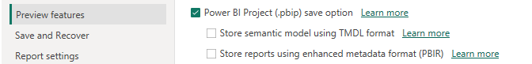
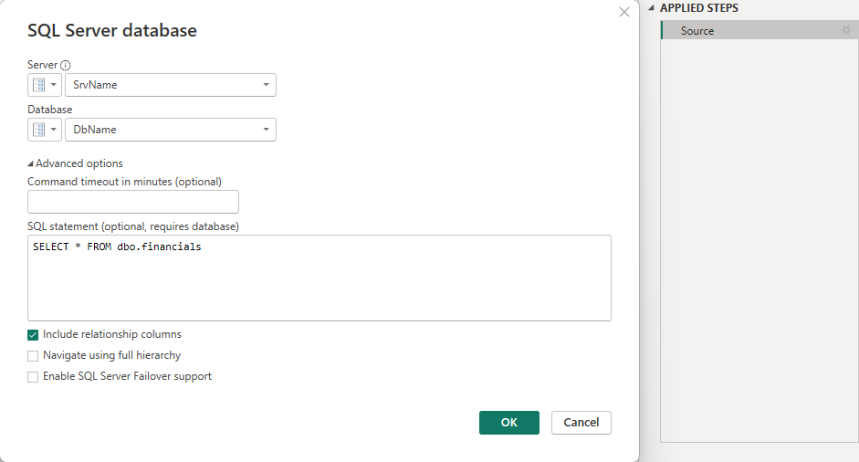

# Microsoft Fabric Git Integration & CI/CD Pipeline Reference Guide

## Power BI Reports Lifecycle Management

## Overview
This tutorial focuses specifically on implementing a complete CI/CD DevOps pipeline for **Power BI Reports** in Microsoft Fabric using Git integration and deployment pipelines. We'll cover the complete lifecycle management across three environments (DEV, UAT, PROD) with approval processes, including the essential Power BI Desktop configurations needed for seamless integration.

Development begins in dedicated feature workspaces, each connected to a corresponding feature branch in Git. After completing and testing changes in a feature workspace, you'll create a pull request to merge those changes into the main branch, which then triggers updates to the DEV environment and initiates the deployment pipeline.

## Architecture Overview - Option 3: Deploy using Fabric Deployment Pipelines

```
Power BI Desktop → Git Repository (Feature/Main Branches) → Fabric Deployment Pipelines

Development Flow:
1. Power BI Desktop ←→ Feature Workspaces (Pull/Push to Feature Branch)
2. Feature Branch → Main Branch (Merge via PR)
3. Main Branch → DEV Workspace (Sync/Update)
4. DEV → UAT → PROD (Deploy via Fabric Deployment Pipelines)
```

**Visual Architecture:**
<p align="center">
   
</p>

<p align="center">
   <strong>Figure: Power BI Desktop &rarr; Feature Workspaces &rarr; Git Branches &rarr; DEV/UAT/PROD Workspaces via Fabric Deployment Pipelines</strong>
</p>

<details>
   <summary>Textual Architecture Flow</summary>
   <pre>
[Power BI Desktop] ←Pull/Push→ [Feature Workspaces] ←Sync→ [Feature Branch]
                                                                                                   ↓ (Merge)
[DEV Workspace] ←Sync/Update→ [Main Branch] ←Branch→ [Main Repository]
         ↓ (Deploy)
[UAT Workspace] 
         ↓ (Deploy with Approval)
[PROD Workspace]
   </pre>
</details>
</br>

**Key Components:**
- **Feature Workspaces:** Connected to feature branches for development
- **Main DEV Workspace:** Connected to main branch, source for deployment pipeline
- **Git Repository:** Central version control with feature and main branches
- **Fabric Deployment Pipelines:** Native Fabric tool for DEV→UAT→PROD deployments
- **Trigger Deployment:** Automated or manual deployment initiation

## Part 1: Power BI Desktop Configuration for Power BI Projects (.pbip)

### Step 1: Power BI Desktop Settings Configuration

Before connecting your workspace to Git, you need to configure Power BI Desktop to support the new Git integration workflow and ensure optimal compatibility with Fabric's version control system.

#### 1.1 Enable Preview Features
1. **Open Power BI Desktop**
2. **Go to File → Options and Settings → Options**
3. **Navigate to Preview Features section**
4. **Enable the following preview feature (Essential for Power BI Projects):**

   **Required for Power BI Projects:**
   
   - ✅ **"Power BI Project (.pbip) save option"**
     - *REQUIRED: This enables saving reports in the new .pbip format*
     - *Essential for version control and Fabric workspace integration*
     - *Allows reports to be stored as decomposed files for better collaboration*

   <p align="center">
      
   </p>
   <p align="center">
   <strong>Figure: Power BI Desktop &rarr; Preview Features &rarr; Power BI Project (.pbip) Save Option</strong>
</p>

   > **📝 Note:**  
   > The options **"Store semantic model using TMDL format"** and **"Store reports using enhanced metadata format (PBIR)"** are visible in Power BI Desktop but cannot be enabled (checked).  
   >  
   > **⚠️ Important:**  
   > These options should remain unchecked because enabling them may cause compatibility issues with Fabric deployment pipelines. Always use the .pbip format for seamless integration and deployment pipeline compatibility.

5. **Restart Power BI Desktop** after enabling the Power BI Project preview feature

#### 1.2 Configure Data Source Settings
The data source configuration is done in **Power Query Editor**, not in the main Options menu. Here's where to configure it:

1. **Open Power BI Desktop**
2. **Click "Transform Data" to open Power Query Editor**
3. **In Power Query Editor, go to Home → Manage Parameters**

**Configure for Multi-Environment Support:**

**Step 1: Create Environment Parameter**
1. Click **"New"** to create a new parameter
2. Configure the Environment parameter:

```
Name: Environment
Description: Current deployment environment (DEV, UAT, or PROD)
Required: ✅ (Check the Required checkbox)
Type: Text (select from dropdown)
Suggested Values: List of values (select from dropdown)
  - Add: DEV
  - Add: UAT  
  - Add: PROD
Current Value: DEV
```

3. Click **OK** to save the Environment parameter

<p align="center">
      
   </p>
<p align="center">
   <strong>Figure: Power Query Editor &rarr; Manage Parameters &rarr; Environment Parameter</strong>
</p>

**Step 2: Create ServerName Parameter**
1. Click **"New"** again to create another parameter
2. Configure the ServerName parameter:

```
Name: SrvName
Description: Database server name based on environment
Required: ✅ (Check the Required checkbox)
Type: Text (select from dropdown)
Suggested Values: Any value (select from dropdown)
Current Value: dev-server-id.database.fabric.microsoft.com
```

3. Click **OK** to save the ServerName parameter

**Step 3: Create DatabaseName Parameter**
1. Click **"New"** for the third parameter
2. Configure the DatabaseName parameter:

```
Name: DbName
Description: Database name based on environment
Required: ✅ (Check the Required checkbox)
Type: Text (select from dropdown)
Suggested Values: Any value (select from dropdown)
Current Value: adventureworks-dev-workspace-id
```

3. Click **OK** to save the DatabaseName parameter

**How Environment Switching Actually Works:**

1. **Local Development:** Use DEV values in parameters
2. **Publish to DEV Workspace:** Parameters keep DEV values  
3. **Deploy DEV → UAT:** Fabric deployment pipeline automatically updates ServerName and DatabaseName parameters to UAT values
4. **Deploy UAT → PROD:** Fabric deployment pipeline automatically updates ServerName and DatabaseName parameters to PROD values

**Step 4: Configure Parameter Values for Each Environment**

When setting up your deployment pipeline, you'll configure parameter rules like this:

```
DEV Environment Parameters:
ServerName: dev-server-id.database.fabric.microsoft.com
DatabaseName: adventureworks-dev-workspace-id
Environment: DEV

UAT Environment Parameters:  
ServerName: uat-server-id.database.fabric.microsoft.com
DatabaseName: adventureworks-uat-workspace-id
Environment: UAT

PROD Environment Parameters:
ServerName: prod-server-id.database.fabric.microsoft.com  
DatabaseName: adventureworks-prod-workspace-id
Environment: PROD
```

**The deployment pipeline handles the parameter switching automatically - you don't need conditional logic in Power Query.**

**Step 5: Apply Parameters to Data Sources**

After creating simple parameters, connect them to your data source:

1. **Go to your data source query** (in Power Query Editor)
2. **Right-click on the Source step**
3. **Select "Edit Settings"** or click the gear icon
4. **Use your parameters in the connection:**
   - **Server:** Select `SrvName` parameter from dropdown
   - **Database:** Select `DbName` parameter from dropdown
   - **Authentication:** Choose **Microsoft account** or **Organizational account**

**Example Result:**
Your connection will look like:
```
Source = Sql.Database(SrvName, DbName)
```

<p align="center">
      
   </p>
<p align="center">
   <strong>Figure: Power Query Editor &rarr; Source step &rarr; Edit Settings</strong>
</p>  

**Step 6: Save the report as PBIP**

Use Consistent Naming Conventions:
   ```
   Report Files:
   - [ProjectName]_[ReportType]_[Version].pbip
   - Example: SalesAnalytics_Dashboard_v1.0.pbip
   ```

<p align="center">
      
   </p>
<p align="center">
   <strong>Figure: Power BI Project &rarr; Structure of Folders</strong>
</p>  
