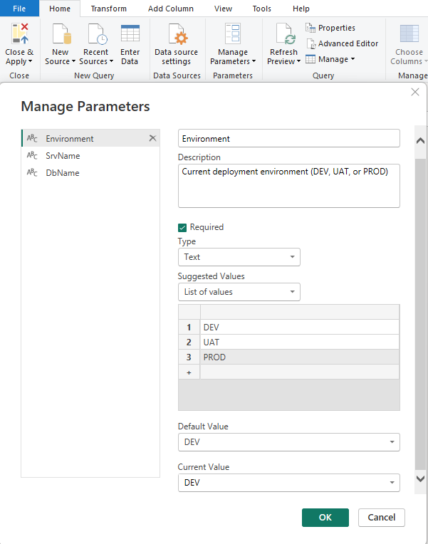

# Microsoft Fabric Git Integration & CI/CD Pipeline Reference Guide

## Power BI Reports Lifecycle Management

## Overview
This tutorial focuses specifically on implementing a complete CI/CD DevOps pipeline for **Power BI Reports** in Microsoft Fabric using Git integration and deployment pipelines. We'll cover the complete lifecycle management across three environments (DEV, UAT, PROD) with approval processes, including the essential Power BI Desktop configurations needed for seamless integration.

Development begins in dedicated feature workspaces, each connected to a corresponding feature branch in Git. After completing and testing changes in a feature workspace, you'll create a pull request to merge those changes into the main branch, which then triggers updates to the DEV environment and initiates the deployment pipeline.

## Architecture Overview - Deploy using Fabric Deployment Pipelines

```
Power BI Desktop → Git Repository (Feature/Main Branches) → Fabric Deployment Pipelines

Development Flow:
1. Power BI Desktop ←→ Feature Workspaces (Pull/Push to Feature Branch)
2. Feature Branch → Main Branch (Merge via PR)
3. Main Branch → DEV Workspace (Sync/Update)
4. DEV → UAT → PROD (Deploy via Fabric Deployment Pipelines)
```

**Visual Architecture:**
<p align="center">
   
</p>

<p align="center">
   <strong>Figure: Power BI Desktop &rarr; Feature Workspaces &rarr; Git Branches &rarr; DEV/UAT/PROD Workspaces via Fabric Deployment Pipelines</strong>
</p>

<details>
   <summary>Textual Architecture Flow</summary>
   <pre>
[Power BI Desktop] ←Pull/Push→ [Feature Workspaces] ←Sync→ [Feature Branch]
         ↓ (Merge)
[DEV Workspace] ←Sync/Update→ [Main Branch] ←Branch→ [Main Repository]
         ↓ (Deploy)
[UAT Workspace] 
         ↓ (Deploy with Approval)
[PROD Workspace]
   </pre>
</details>
</br>

**Key Components:**
- **Feature Workspaces:** Connected to feature branches for development
- **Main DEV Workspace:** Connected to main branch, source for deployment pipeline
- **Git Repository:** Central version control with feature and main branches
- **Fabric Deployment Pipelines:** Native Fabric tool for DEV→UAT→PROD deployments
- **Trigger Deployment:** Automated or manual deployment initiation

## Part 1: Power BI Desktop Configuration for Power BI Projects (.pbip)

### Step 1: Power BI Desktop Settings Configuration

Before connecting your workspace to Git, you need to configure Power BI Desktop to support the new Git integration workflow and ensure optimal compatibility with Fabric's version control system.

#### 1.1 Enable Preview Features
1. **Open Power BI Desktop**
2. **Go to File → Options and Settings → Options**
3. **Navigate to Preview Features section**
4. **Enable the following preview feature (Essential for Power BI Projects):**

   **Required for Power BI Projects:**
   
   - ✅ **"Power BI Project (.pbip) save option"**
     - *REQUIRED: This enables saving reports in the new .pbip format*
     - *Essential for version control and Fabric workspace integration*
     - *Allows reports to be stored as decomposed files for better collaboration*

   <p align="center">
      
   </p>
   <p align="center">
   <strong>Figure: Power BI Desktop &rarr; Preview Features &rarr; Power BI Project (.pbip) Save Option</strong>
</p>

   > **📝 Note:**  
   > The options **"Store semantic model using TMDL format"** and **"Store reports using enhanced metadata format (PBIR)"** are visible in Power BI Desktop but cannot be enabled (checked).  
   >  
   > **⚠️ Important:**  
   > These options should remain unchecked because enabling them may cause compatibility issues with Fabric deployment pipelines. Always use the .pbip format for seamless integration and deployment pipeline compatibility.

5. **Restart Power BI Desktop** after enabling the Power BI Project preview feature

#### 1.2 Configure Data Source Settings
The data source configuration is done in **Power Query Editor**, not in the main Options menu. Here's where to configure it:

1. **Open Power BI Desktop**
2. **Click "Transform Data" to open Power Query Editor**
3. **In Power Query Editor, go to Home → Manage Parameters**

**Configure for Multi-Environment Support:**

**Step 1: Create Environment Parameter**
1. Click **"New"** to create a new parameter
2. Configure the Environment parameter:

```
Name: Environment
Description: Current deployment environment (DEV, UAT, or PROD)
Required: ✅ (Check the Required checkbox)
Type: Text (select from dropdown)
Suggested Values: List of values (select from dropdown)
  - Add: DEV
  - Add: UAT  
  - Add: PROD
Current Value: DEV
```

3. Click **OK** to save the Environment parameter

<p align="center">
      
   </p>
<p align="center">
   <strong>Figure: Power Query Editor &rarr; Manage Parameters &rarr; Environment Parameter</strong>
</p>

**Step 2: Create ServerName Parameter**
1. Click **"New"** again to create another parameter
2. Configure the ServerName parameter:

```
Name: SrvName
Description: Database server name based on environment
Required: ✅ (Check the Required checkbox)
Type: Text (select from dropdown)
Suggested Values: Any value (select from dropdown)
Current Value: dev-server-id.database.fabric.microsoft.com
```

3. Click **OK** to save the ServerName parameter

**Step 3: Create DatabaseName Parameter**
1. Click **"New"** for the third parameter
2. Configure the DatabaseName parameter:

```
Name: DbName
Description: Database name based on environment
Required: ✅ (Check the Required checkbox)
Type: Text (select from dropdown)
Suggested Values: Any value (select from dropdown)
Current Value: adventureworks-dev-workspace-id
```

3. Click **OK** to save the DatabaseName parameter

**How Environment Switching Actually Works:**

1. **Local Development:** Use DEV values in parameters
2. **Publish to DEV Workspace:** Parameters keep DEV values  
3. **Deploy DEV → UAT:** Fabric deployment pipeline automatically updates ServerName and DatabaseName parameters to UAT values
4. **Deploy UAT → PROD:** Fabric deployment pipeline automatically updates ServerName and DatabaseName parameters to PROD values

**Step 4: Configure Parameter Values for Each Environment**

When setting up your deployment pipeline, you'll configure parameter rules like this:

```
DEV Environment Parameters:
ServerName: dev-server-id.database.fabric.microsoft.com
DatabaseName: adventureworks-dev-workspace-id
Environment: DEV

UAT Environment Parameters:  
ServerName: uat-server-id.database.fabric.microsoft.com
DatabaseName: adventureworks-uat-workspace-id
Environment: UAT

PROD Environment Parameters:
ServerName: prod-server-id.database.fabric.microsoft.com  
DatabaseName: adventureworks-prod-workspace-id
Environment: PROD
```

**The deployment pipeline handles the parameter switching automatically - you don't need conditional logic in Power Query.**

**Step 5: Apply Parameters to Data Sources**

After creating simple parameters, connect them to your data source:

1. **Go to your data source query** (in Power Query Editor)
2. **Right-click on the Source step**
3. **Select "Edit Settings"** or click the gear icon
4. **Use your parameters in the connection:**
   - **Server:** Select `SrvName` parameter from dropdown
   - **Database:** Select `DbName` parameter from dropdown
   - **Authentication:** Choose **Microsoft account** or **Organizational account**

**Example Result:**
Your connection will look like:
```
Source = Sql.Database(SrvName, DbName)
```

<p align="center">
      
   </p>
<p align="center">
   <strong>Figure: Power Query Editor &rarr; Source step &rarr; Edit Settings</strong>
</p>  

**Step 6: Save the report as PBIP**

Use Consistent Naming Conventions:
   ```
   Report Files:
   - [ProjectName]_[ReportType]_[Version].pbip
   - Example: SalesAnalytics_Dashboard_v1.0.pbip
   ```

<p align="center">
      
   </p>
<p align="center">
   <strong>Figure: Power BI Project &rarr; Structure of Folders</strong>
</p>  

## Part 2: Microsoft Fabric Git Configuration for Power BI Reports

### Prerequisites
- Microsoft Fabric Premium or Trial capacity
- **Power BI Desktop (Latest Version)** with proper configuration
- GitHub repository / Azure Repository for version control
- Basic understanding of Git concepts (branches, commits, pull requests)
- Admin access to Fabric workspaces
- Understanding of Power BI report development lifecycle

### Step 1: Enable Git Integration in Fabric

<p align="center">
      
</p>
<p align="center">
   <strong>Figure: Tenant settings &rarr; Git integration</strong>
</p>  

<p align="center">
      
</p>
<p align="center">
   <strong>Figure: Tenant settings &rarr; Users can create Fabric Items</strong>
</p> 


#### 1.1 Tenant Settings Configuration
First, ensure Git integration is enabled at the tenant level. Git integration settings can be managed at two levels: **Tenant-wide** or **Capacity-specific** through delegated tenant settings.

1. Navigate to **Microsoft Fabric Admin Portal**
2. Go to **Capacity settings** (as shown in your screenshot)
3. Select your Fabric capacity
4. Navigate to **Delegated tenant settings** tab
5. Find **Git integration** section

**Understanding Delegated Tenant Settings:**

Delegated tenant settings allow capacity admins to **override** tenant-level settings for their specific capacity. This provides more granular control over Git integration.

**Git Integration Settings Configuration:**

**Core Git Integration Settings:**
- ✅ **"Users can synchronize workspace items with their Git repositories"**
  - *Can be enabled at tenant level OR capacity level*
  - Allows import and export of workspace items to Git repositories for collaboration and version control
  - **Key Setting:** "Override tenant admin selection" ✅ allows capacity-specific configuration

**Configuration Options (as shown in your screenshot):**
```
Enabled: ✅ (Toggle enabled for capacity)
Apply to: 
• All the users in capacity (recommended for organizational CI/CD)
○ Specific security groups (for limited rollout)
□ Except specific security groups (for exclusions)

Delegate setting to other admins:
✅ Workspace admins can enable/disable (allows workspace-level control)
```
<p align="center">
      
</p>
<p align="center">
   <strong>Figure: Capacity settings &rarr; Git integration</strong>
</p>  

**GitHub-Specific Settings:**
- ✅ **"Users can sync workspace items with GitHub repositories"**  
  - *Enabled for all users in capacity*
  - Users can select GitHub as their Git provider and sync items in their workspaces with GitHub repositories
  - Must be enabled along with the general Git synchronization setting

**Additional Git Integration Settings:**
- ✅ **"Users can export items to Git repositories in other geographical locations"**
  - *Enabled for all users in capacity*
  - Allows cross-region Git repository connections
  
- ✅ **"Users can export workspace items with applied sensitivity labels to Git repositories"**
  - *Enabled for all users in capacity*
  - Important for organizations using Microsoft Purview sensitivity labels

**General Fabric Settings:**
- ✅ **"Users can create Fabric items"**
  - *Enabled for all users in capacity*
  - Users can use production-ready features to create Fabric items

**Note: The following settings are only available at TENANT level, not capacity level:**

**Tenant-Only Settings (Configure in Admin Portal → Tenant Settings):**
- ✅ **"Create workspaces"** 
  - *Only configurable at tenant level*
  - Users can create app workspaces to collaborate on dashboards, reports, and other content

  <p align="center">
      
</p>
<p align="center">
   <strong>Figure: Tenant settings &rarr; Create workspaces</strong>
</p> 


**Best Practices for Delegated Tenant Settings:**

1. **Capacity-Level Control:**
   - Enable Git integration at **capacity level** for better control
   - Apply to **"All the users in capacity"** for organizational CI/CD
   - Enable **"Workspace admins can enable/disable"** for flexibility

2. **Security Considerations:**
   - Use **"Specific security groups"** for phased rollouts
   - Consider **"Except specific security groups"** for sensitive workspaces
   - Review sensitivity label integration if using Microsoft Purview

3. **Administrative Delegation:**
   - ✅ **"Override tenant admin selection"** gives capacity admins control
   - ✅ **"Workspace admins can enable/disable"** provides workspace-level flexibility
   - Allows decentralized management while maintaining governance

**Verification Steps:**
1. **Check capacity assignment:** Ensure your workspaces are assigned to this capacity
2. **Verify settings cascade:** Capacity settings override tenant settings
3. **Test workspace access:** Confirm users can see Git integration options
4. **Validate permissions:** Ensure workspace admins have appropriate delegation rights

> **⚠️ Important:** When using delegated tenant settings at the capacity level, these settings **override** the tenant-wide settings. This means you have more granular control but need to ensure all necessary capacities have the correct configuration for your CI/CD pipeline to work across DEV, UAT, and PROD environments.

#### 2.2 Workspace Structure for Architecture
For the Fabric deployment pipelines approach, you'll need multiple workspaces to support the complete CI/CD lifecycle. Here's an example of a well-structured workspace organization:

**Example Workspace Structure:**

<p align="center">
      
</p>
<p align="center">
   <strong>Figure: Microsoft Fabric &rarr; Workspaces</strong>
</p> 

1. **Development Environment:**
   ```
   Workspace Name: FABRIC-CATALYST-GH-DEV
   Purpose: Main development workspace connected to Git main branch
   Role: Source workspace for deployment pipeline
   Git Connection: Connected to main branch
   ```

2. **Feature Development Workspaces:**
   ```
   Workspace Name: FABRIC-CATALYST-GH-FEATURE
   Purpose: Individual feature development and testing
   Role: Connected to feature branches for isolated development
   Git Connection: Connected to feature branches (feature/dashboard, feature/reports, etc.)
   ```

3. **User Acceptance Testing Environment:**
   ```
   Workspace Name: FABRIC-CATALYST-GH-STG (Staging/UAT)
   Purpose: User acceptance testing and validation
   Role: Target for DEV deployments, source for PROD deployments
   Git Connection: Managed through deployment pipeline (no direct Git connection)
   ```

4. **Production Environment:**
   ```
   Workspace Name: FABRIC-CATALYST-GH-PROD
   Purpose: Live production environment
   Role: Final deployment target for validated reports
   Git Connection: Managed through deployment pipeline (no direct Git connection)
   ```

**Workspace Naming Convention Benefits:**

- ✅ **Consistent Prefix:** `FABRIC-CATALYST-GH` identifies the project 
- ✅ **Clear Environment Identification:** DEV, FEATURE, STG, PROD
- ✅ **Git Integration Indicator:** `GH` indicates GitHub integration

**Workspace Assignment Requirements:**
- **All workspaces must be assigned to Fabric capacity** (shown by capacity icons in screenshot)  
- **Required for Git integration:** To access the Git integration feature, you need a Fabric capacity
- **Required for deployment pipelines:** Each workspace in the pipeline must reside on a Fabric capacity

**Important Clarification on Deployment Pipelines and Capacity:**

**How Deployment Pipelines Actually Work:**

✅ **Pipeline Infrastructure:** Deployment pipelines are a **SaaS orchestration layer** managed by Microsoft Fabric itself, operating independently of workspace capacities

✅ **Pipeline Execution:** When a pipeline runs:
- **Orchestration activities** (triggering deployments) are billed to the **source workspace's capacity**
- **Example:** Deploying from DEV to UAT consumes minimal CU from the DEV workspace capacity
- The pipeline itself doesn't "reside" on any specific capacity

✅ **Post-Deployment:** After deployment completes:
- Activities in the **target workspace** (e.g., UAT, PROD) use the **target workspace's capacity**
- The pipeline itself does not consume resources at this stage

**Capacity Requirements Clarified:**

✅ **Git Integration:** A Fabric capacity is required to use all supported Fabric items and specifically for Git integration features

✅ **Deployment Pipeline Workspaces:** Each workspace participating in the pipeline must be assigned to a Fabric capacity

✅ **Pipeline Orchestration:** The deployment pipeline service itself is managed by Microsoft Fabric (no capacity assignment needed)

✅ **Active Capacity for Execution:** The source workspace capacity must be active during deployment execution

✅ **Fabric vs Premium Capacity:** Customers that already have a Power BI Premium capacity, can use that capacity, but keep in mind that certain Power BI SKUs only support Power BI items

**Operational Requirements:**
- **Source Capacity Active:** The capacity hosting the source workspace must be active during deployment
- **Target Capacity Active:** The capacity hosting the target workspace must be active to receive deployment
- **Multi-Environment:** All workspace capacities (DEV, UAT, PROD) must be active for the complete pipeline
- **Cost Consideration:** Deployment orchestration consumes minimal CUs from source workspace capacity

**Next Steps:**

Now that you have your workspace structure and .pbip project ready, here are the specific next steps to implement your CI/CD strategy:

**Step 3: Connect FABRIC-CATALYST-GH-DEV to Git main branch**
- Navigate to `FABRIC-CATALYST-GH-DEV` workspace settings
- Go to Git integration tab
- Connect to your GitHub repository `main` branch
- This workspace will be the source for your deployment pipeline

**Step 4: Connect FABRIC-CATALYST-GH-FEATURE to feature branches**
- Navigate to `FABRIC-CATALYST-GH-FEATURE` workspace settings  
- Go to Git integration tab
- Connect to your GitHub repository `feature/financial-sales-analytics` branch
- Publish your `FinancialSalesAnalytics_Dashboard_v1.0.pbip` here
- Perform initial sync: Workspace → Git

**Step 5: Create deployment pipeline linking DEV → STG → PROD**
- Navigate to Deployment Pipelines in Fabric
- Create new pipeline: "FABRIC-CATALYST-Pipeline"
- Configure three stages:
  - Development: `FABRIC-CATALYST-GH-DEV`
  - Test: `FABRIC-CATALYST-GH-STG` 
  - Production: `FABRIC-CATALYST-GH-PROD`

**Step 6: Configure approval gates for STG and PROD deployments**
- Set up manual approval for DEV → STG deployment
- Set up multi-stage approval for STG → PROD deployment
- Configure approval notifications and criteria

**Implementation Sequence:**
```
Current Status: 
✅ Workspaces created, .pbip project ready
Next Actions:
1. Git Integration Setup (Steps 3-4)
2. Feature Development & PR Workflow  
3. Deployment Pipeline Creation (Steps 5-6)
4. End-to-End Testing
```

These steps will complete your architecture implementation and enable the full Feature → DEV → UAT → PROD workflow with Git version control and approval gates.

### Step 2: Connect DEV Workspace to GitHub

#### 2.1 Prepare GitHub Repository for Power BI Reports
1. Create a new GitHub repository or use existing one
2. **Power BI-focused repository structure:**
   ```
   PBIP_Fabric_Reference_Guide/
   ├── .github/
   │   └── workflows/
   │       ├── dev-to-uat-reports.yml
   │       └── uat-to-prod-reports.yml
   ├── fabric/
   │   ├── workspace/
   │   │   ├── FinancialSalesAnalytics_Dashboard_v1.0.Report/
   │   │   └── FinancialSalesAnalytics_Dashboard_v1.0.SemanticModel/
   ├── scripts/
   │   └── deployall.ps1
   ├── .gitignore                    # ← Important for security
   └── README.md
   ```

3. **Security Best Practices - Do NOT store sensitive information in Git:**

   **❌ Never commit these to your repository:**
   - Database connection strings
   - Server URLs or endpoints
   - Workspace names or IDs
   - Authentication tokens or passwords
   - Capacity identifiers
   - Environment-specific configuration files with real values

   **✅ Secure Alternatives:**

   **Option 1: Use Template Configuration Files**
   Create template files with placeholder values:
   ```json
   // config/template-config.json (safe to commit)
   {
     "environment": "TEMPLATE",
     "workspace": "PROJECT-NAME-{ENVIRONMENT}",
     "dataSourceSettings": {
       "serverName": "{SERVER-ENDPOINT-PLACEHOLDER}",
       "databaseName": "{DATABASE-NAME-PLACEHOLDER}"
     }
   }
   ```

   **Option 2: Documentation-Only Approach**
   Create documentation that describes the configuration without real values:
   ```markdown
   # Environment Configuration Guide
   
   ## Parameter Mapping
   Each environment requires the following parameters to be configured
   in the Fabric deployment pipeline:
   
   - SrvName: Fabric SQL endpoint for the environment
   - DbName: Database identifier for the environment  
   - Environment: Environment identifier (DEV/UAT/PROD)
   
   ## Deployment Pipeline Configuration
   Configure parameter rules in Fabric deployment pipeline to automatically
   update these values during deployment between environments.
   ```

   **Option 3: Use GitHub Secrets (for CI/CD automation)**
   Store sensitive values as GitHub repository secrets:
   - `DEV_SERVER_NAME`
   - `UAT_SERVER_NAME`  
   - `PROD_SERVER_NAME`
   - Reference these in GitHub Actions workflows without exposing values

   **Option 4: Fabric-Native Parameter Management**
   Let Fabric deployment pipelines handle all environment-specific configurations:
   - Configure parameter rules directly in the deployment pipeline
   - No configuration files needed in Git
   - All sensitive values managed within Fabric's secure environment

**In this reference guide we will use Option 4:**

We will use **Option 4 (Fabric-Native Parameter Management)** as it's the most secure and aligns with Fabric's built-in capabilities. The deployment pipeline automatically handles parameter updates without requiring any sensitive information in your Git repository.

#### 2.2 Connect Workspace to Git
1. **In your DEV Workspace:**
   - Click on **Workspace settings**
   - Select **Git integration** tab
   - Click **Connect to Git**

2. **Configure Git Connection:**
   ```
   Git provider: GitHub
   Organization: [your-github-org]
   Repository: [your-repo-name]
   Branch: main (or dev)
   Folder: / (root) or specify subfolder
   ```

3. **Authentication:**
   - You'll be redirected to GitHub for authentication
   - Grant necessary permissions to Microsoft Fabric

<p align="center">
      
</p>
<p align="center">
   <strong>Figure: Microsoft Fabric &rarr; Workspaces DEV &rarr; Git integration</strong>
</p>    

#### 2.3 Initial Sync - Feature Branch Workflow
When implementing the architecture defined, your first sync will typically be from a **Feature workspace to Feature branch**.

**Typical First Sync Scenario:**
1. **Develop locally:** Create your `FinancialSalesAnalytics_Dashboard_v1.0.pbip` in Power BI Desktop
2. **Publish to Feature workspace:** Upload your .pbip to `FABRIC-CATALYST-GH-FEATURE` workspace
3. **Connect workspace to Git:** Connect the Feature workspace to a feature branch
4. **Initial sync:** Sync from workspace to Git (since workspace has content, Git branch is empty)

**After Initial Sync:** Go to GitHub Repository and validate the Feature Branch Structure.

<p align="center">
      
</p>
<p align="center">
   <strong>Figure: Microsoft Fabric &rarr; Workspaces Feature &rarr; Git integration</strong>
</p>

**Next Steps in Feature Development:**
1. **Continue development** in Feature workspace
2. **Regular commits** to feature branch as you make changes
3. **Create Pull Request** when feature is ready
4. **Merge to main branch** (triggers DEV workspace update)
5. **Deploy via pipeline** from DEV → UAT → PROD

### Step 3: Git Branch Strategy

#### 3.1 Branch Structure for Feature → DEV Workflow
```
main (production-ready code) ← Connected to FABRIC-CATALYST-GH-DEV workspace
└── feature ← Connected to FABRIC-CATALYST-GH-FEATURE workspace
```

#### 3.2 Workspace-to-Branch Mapping
```
Git Branch                          ↔ Fabric Workspace
────────────────────────────────────────────────────────────
main                               ↔ FABRIC-CATALYST-GH-DEV (Pipeline Source)
feature                            ↔ FABRIC-CATALYST-GH-FEATURE
```

#### 3.3 Your Development Workflow

**Phase 1: Feature Development**
1. **Develop locally:** Create `FinancialSalesAnalytics_Dashboard_v1.0.pbip` in Power BI Desktop
2. **Publish to Feature workspace:** Upload to `FABRIC-CATALYST-GH-FEATURE`
3. **Connect Feature workspace to Git:**
   - Connect `FABRIC-CATALYST-GH-FEATURE` → `feature` branch
   - Initial sync: Workspace → Git (pushes your dashboard to feature branch)

**Phase 2: Git Configuration** 
4. **Connect DEV workspace to Git:**
   - Connect `FABRIC-CATALYST-GH-DEV` → `main` branch
   - This workspace will receive updates when feature branches merge to main

**Phase 3: Feature Integration**
5. **Create Pull Request:**
   - From: `feature` 
   - To: `main` branch
   - Include description of dashboard features and changes

6. **Code Review & Merge:**
   - Team reviews the Power BI changes (.pbir and .pbids files)
   - Approve and merge PR to main branch
   - This automatically triggers DEV workspace update

<p align="center">
      
</p>
<p align="center">
   <strong>Figure: Microsoft Fabric &rarr; Workspaces Feature &rarr; Git integration</strong>
</p>


**Phase 4: Deployment Pipeline**

7. **DEV workspace updates automatically** when main branch changes
8. **Use Fabric deployment pipeline** to promote: DEV → UAT → PROD


**Key Benefits of This Approach:**

- ✅ **Isolated Development:** Feature workspace provides safe development environment
- ✅ **Version Control:** All changes tracked in Git with proper branching
- ✅ **Code Review:** PR process ensures quality before DEV integration
- ✅ **Automated Integration:** Main branch updates automatically sync to DEV workspace
- ✅ **Deployment Pipeline:** Clean handoff from Git to Fabric deployment pipelines

## Part 3: Fabric Deployment Pipelines Configuration

### Step 1: Create Fabric Deployment Pipeline
1. **Navigate to Deployment Pipelines in Microsoft Fabric**
2. **Create new deployment pipeline:**
   ```
   Pipeline name: PowerBI-Reports-Lifecycle
   Description: Automated deployment from DEV to UAT to PROD
   Pipeline Type: Standard (3-stage pipeline)
   ```

### Step 2: Configure Three-Stage Pipeline
1. **Set up pipeline stages:**
   ```
   Stage 1: DEV
   - Workspace: FABRIC-CATALYST-GH-DEV
   - Source: Connected to Git main branch
   - Role: Source workspace for all deployments

   Stage 2: UAT
   - Workspace: FABRIC-CATALYST-GH-UAT
   - Source: Deployed from DEV stage
   - Role: User acceptance testing environment
   
   Stage 3: PROD
   - Workspace: FABRIC-CATALYST-GH-PROD
   - Source: Deployed from UAT stage
   - Role: Live production environment
   ```

2. **Assign workspaces to stages:**
   - Development stage → FABRIC-CATALYST-GH-DEV (Git connected)
   - Test stage → FABRIC-CATALYST-GH-UAT (Pipeline managed)
   - Production stage → FABRIC-CATALYST-GH-PROD (Pipeline managed)

<p align="center">
      
<p align="center">
   <strong>Figure: Microsoft Fabric &rarr; Deployment Pipeline</strong>
</p>

### Step 3: Configure Deployment Rules

**⚠️ Important:** Deployment rules can only be configured AFTER the first deployment. You must complete an initial deployment without rules first.

#### 3.1 Initial Deployment (Without Rules)
**First, deploy your content without any rules configured:**

1. **Select Power BI items to deploy:**
   - ✅ Power BI Reports (FinancialSalesAnalytics_Dashboard_v1.0)
   - ✅ Power BI Datasets/Semantic Models (FinancialSalesAnalytics_Dashboard_v1.0)
   - ✅ Any dataflows (if used)
   - ✅ Report metadata and themes

2. **Perform initial deployment:**
   - Deploy from DEV → UAT without any parameter rules
   - This copies items with their current DEV parameter values
   - Items will initially use DEV database connections in UAT (expected)

3. **Verify successful deployment:**
   - Check that items appear in UAT workspace
   - Confirm deployment shows "Successful deployment" status

#### 3.2 Configure Parameter Rules (After First Deployment)
**Only after successful deployment, configure parameter mapping rules:**

1. **Access deployment rules:**
   - Go to your deployment pipeline
   - Click on "Deployment rules" for the UAT stage
   - Select your semantic model (FinancialSalesAnalytics_Dashboard_v1.0)

2. **Configure parameter mappings:**
   ```
   Parameter Rules Configuration:
   ─────────────────────────────────
   Parameter Name: Environment
   DEV Value: DEV → UAT Value: UAT
   
   Parameter Name: SrvName  
   DEV Value: dev-server-endpoint → UAT Value: uat-server-endpoint
   
   Parameter Name: DbName
   DEV Value: dev-database-id → UAT Value: uat-database-id
   ```

3. **Save parameter rules**

<p align="center">
      
<p align="center">
   <strong>Figure: Microsoft Fabric &rarr; Deployment Pipeline &rarr; Parameter Rules</strong>
</p>


## Part 4: GitHub Actions CI/CD Pipeline Implementation

### Overview
This section completes the automation by implementing GitHub Actions workflows that automatically trigger the Fabric deployment pipeline when changes are pushed to the main branch, with proper approval gates for UAT and PROD environments.

### Step 1: Create Service Principal for Fabric Access

#### 1.1 Create Azure Service Principal
```bash
# Using Azure CLI
az ad sp create-for-rbac --name "fabric-cicd-sp" --role contributor --scopes /subscriptions/{subscription-id}
```

**Or via Azure Portal:**
1. Go to **Microsoft Entra ID > App registrations**
2. Click **New registration**
3. Name: `fabric-cicd-sp`
4. Supported account types: **Accounts in this organizational directory only**
5. Click **Register**

#### 1.2 Configure API Permissions
1. Go to **API permissions**
2. Click **Add a permission**
3. Select **Power BI Service**
4. Choose **Delegated permissions**
5. Add the following permissions:
   - `Tenant.Read.All`
   - `Workspace.ReadWrite.All`
   - `Pipeline.Deploy`
   - `Pipeline.Read.All`

6. Click **Grant admin consent** for your organization

#### 1.3 Create Client Secret
1. Go to **Certificates & secrets**
2. Click **New client secret**
3. Description: `fabric-cicd-secret`
4. Expires: **24 months** (recommended)
5. Click **Add**
6. **Copy the secret value** (you won't see it again)

**Save these values:**
```
Tenant ID: [from Azure AD Overview]
Client ID (Application ID): [from App registration Overview]
Client Secret: [the secret value you just copied]
```

### Step 2: Grant Service Principal Access to Fabric Workspaces

#### 2.1 Add Service Principal to DEV Workspace
1. Go to your **DEV Workspace** (`FABRIC-CATALYST-GH-DEV`) in Fabric
2. Click **Manage access**
3. Click **Add people or groups**
4. Search for your Service Principal: `fabric-cicd-sp`
5. Select role: **Admin**
6. Click **Add**

#### 2.2 Add Service Principal to UAT Workspace
1. Go to your **UAT Workspace** (`FABRIC-CATALYST-GH-STG`) in Fabric
2. Click **Manage access**
3. Click **Add people or groups**
4. Search for your Service Principal: `fabric-cicd-sp`
5. Select role: **Admin**
6. Click **Add**

#### 2.3 Add Service Principal to PROD Workspace
1. Go to your **PROD Workspace** (`FABRIC-CATALYST-GH-PROD`) in Fabric
2. Click **Manage access**
3. Click **Add people or groups**
4. Search for your Service Principal: `fabric-cicd-sp`
5. Select role: **Admin**
6. Click **Add**

#### 2.4 Add Service Principal to Deployment Pipeline
1. Go to your **Deployment Pipeline** (`PowerBI-Reports-Lifecycle`) in Fabric
2. Click **Settings** (gear icon)
3. Click **Manage users**
4. Click **Add user**
5. Search for: `fabric-cicd-sp`
6. Select role: **Admin**
7. Click **Add**

### Step 3: Configure GitHub Repository

#### 3.1 Repository Structure
Ensure your repository has this structure:
```
your-repo/
├── .github/
│   └── workflows/
│       └── fabric-deployment.yml    # Main CI/CD workflow
├── scripts/
│   └── deploy_all.py               # Python deployment script (already created)
├── fabric/
│   └── workspace/                  # Your .pbip files from Git sync
└── README.md                       # This documentation
```

#### 3.2 Repository Secrets Configuration
Go to `Settings > Secrets and variables > Actions` and add:

```bash
# Azure/Fabric Authentication
FABRIC_TENANT_ID=your-azure-tenant-id
FABRIC_CLIENT_ID=your-service-principal-client-id
FABRIC_CLIENT_SECRET=your-service-principal-client-secret

# Fabric Configuration
FABRIC_PIPELINE_NAME=PowerBI-Reports-Lifecycle  # Your deployment pipeline name

# Workspace IDs (Optional - can be managed via pipeline)
DEV_WORKSPACE_ID=your-dev-workspace-id
UAT_WORKSPACE_ID=your-uat-workspace-id
PROD_WORKSPACE_ID=your-prod-workspace-id
```

### Step 4: Configure GitHub Environment Protection Rules

#### 4.1 Create GitHub Environments
1. Go to `Settings > Environments`
2. Create these environments:
   - **UAT** 
   - **PROD**

#### 4.2 Configure UAT Environment Protection
1. Click on **UAT** environment
2. Configure **Deployment protection rules:**

   **Required reviewers:**
   - ✅ Add reviewers (jesusher, darkanita as shown in your screenshot)
   - ✅ Prevent self-review (optional)
   
   **Wait timer:**
   - ⚪ Optional: Set wait time before deployment (e.g., 0 minutes)
   
   **Deployment branches:**
   - ✅ Selected branches only
   - Add rule: `main` branch only

3. Click **Save protection rules**

#### 4.3 Configure PROD Environment Protection
1. Click on **PROD** environment
2. Configure **Deployment protection rules:**

   **Required reviewers:**
   - ✅ Add senior reviewers for production deployments
   - ✅ Prevent self-review
   - ✅ Require different approvers than UAT (recommended)
   
   **Wait timer:**
   - ✅ Set 5-10 minutes wait time (cooling period)
   
   **Deployment branches:**
   - ✅ Selected branches only
   - Add rule: `main` branch only

3. Click **Save protection rules**

### Step 5: Create GitHub Actions Workflow

Your `fabric-deployment.yml` workflow should look like this:

```yaml
name: Power BI CI/CD Pipeline

on:
  push:
    branches:
      - main
  workflow_dispatch:

jobs:
  deploy-uat:
    name: Deploy to UAT
    runs-on: ubuntu-latest
    environment: UAT  # This triggers approval gate
    
    steps:
      - name: Checkout repository
        uses: actions/checkout@v4
        
      - name: Setup Python
        uses: actions/setup-python@v4
        with:
          python-version: '3.11'
          
      - name: Install Python dependencies
        run: |
          pip install requests python-dotenv
          
      - name: Deploy to UAT
        run: python ./scripts/deploy_all.py
        env:
          TENANT_ID: ${{ secrets.FABRIC_TENANT_ID }}
          APP_ID: ${{ secrets.FABRIC_CLIENT_ID }}
          CLIENT_SECRET: ${{ secrets.FABRIC_CLIENT_SECRET }}
          PIPELINE_NAME: ${{ secrets.FABRIC_PIPELINE_NAME }}
          STAGE_ORDER: 0  # Deploy from DEV (0) to UAT (1)

  deploy-prod:
    name: Deploy to Production
    runs-on: ubuntu-latest
    environment: PROD  # This triggers approval gate
    needs: deploy-uat  # Only runs after UAT succeeds
    
    steps:
      - name: Checkout repository
        uses: actions/checkout@v4
        
      - name: Setup Python
        uses: actions/setup-python@v4
        with:
          python-version: '3.11'
          
      - name: Install Python dependencies
        run: |
          pip install requests python-dotenv
          
      - name: Deploy to Production
        run: python ./scripts/deploy_all.py
        env:
          TENANT_ID: ${{ secrets.FABRIC_TENANT_ID }}
          APP_ID: ${{ secrets.FABRIC_CLIENT_ID }}
          CLIENT_SECRET: ${{ secrets.FABRIC_CLIENT_SECRET }}
          PIPELINE_NAME: ${{ secrets.FABRIC_PIPELINE_NAME }}
          STAGE_ORDER: 1  # Deploy from UAT (1) to PROD (2)
```

### Step 6: Test the Complete CI/CD Pipeline

#### 6.1 Initial Validation
1. **Test Service Principal access locally:**
   ```bash
   # Run this locally to test authentication
   python scripts/deploy_all.py [tenant_id] [client_id] [client_secret] [pipeline_name] 0
   ```

2. **Verify pipeline access:**
   - Ensure the service principal can see your deployment pipeline
   - Confirm workspace permissions are working

#### 6.2 End-to-End Testing

**Complete Development and Deployment Flow:**

1. **Feature Development:**
   ```bash
   # In your feature workspace, make changes to your Power BI reports
   # Sync workspace → feature branch
   ```

2. **Create Pull Request:**
   ```bash
   # Create PR from feature branch to main branch
   # Review and approve the PR
   # Merge to main branch
   ```

3. **Manual DEV Workspace Sync (Required):**
   ```bash
   # ⚠️ IMPORTANT: After PR merge, manually sync DEV workspace
   # 1. Go to FABRIC-CATALYST-GH-DEV workspace
   # 2. Navigate to Source control or Git integration
   # 3. Click "Update all" or "Sync" from Git → Workspace
   # 4. This step is currently manual - no auto-sync from Git to workspace
   ```

4. **Automatic CI/CD Trigger:**
   ```bash
   # After manual DEV workspace sync, trigger GitHub Actions:
   # 1. Push to main branch or manual workflow trigger
   # 2. GitHub Actions workflow execution
   # 3. UAT deployment approval request
   ```

5. **Monitor and Approve:**
   - Go to `Actions` tab in GitHub
   - Watch the workflow execution
   - **Approve UAT deployment** when prompted by reviewers
   - **Approve PROD deployment** when prompted by reviewers

## Part 5: Complete Deployment Flow

### 5.1 Automated Workflow Triggers

**On Push to Main Branch:**
```
Feature Branch → Main Branch (PR Merge) 
    ↓
⚠️ MANUAL STEP: Update DEV Workspace from Git
    ↓
GitHub Actions Workflow Triggered (manual or push)
    ↓
UAT Approval Required → Deploy DEV to UAT (Fabric Pipeline)
    ↓  
PROD Approval Required → Deploy UAT to PROD (Fabric Pipeline)
```

**Manual Trigger:**
- Can be triggered manually from GitHub Actions tab
- Same approval flow applies
- **Prerequisite:** Ensure DEV workspace is manually synced with main branch first

### 5.2 Approval Process

1. **UAT Deployment:**
   - Triggered automatically after push to main
   - **Reviewers:** jesusher, darkanita (as configured)
   - Must be approved before deployment proceeds
   - Deploys from DEV → UAT using `STAGE_ORDER: 0`

2. **PROD Deployment:**
   - Triggered automatically after successful UAT deployment
   - **Reviewers:** Your configured PROD reviewers
   - Optional wait timer before allowing approval
   - Deploys from UAT → PROD using `STAGE_ORDER: 1`

### 5.3 Monitoring and Troubleshooting

#### GitHub Actions Dashboard
- View all workflow runs in the `Actions` tab
- Monitor deployment status and logs
- Download logs for troubleshooting

#### Common Issues and Solutions

**Authentication Failures:**
- Verify service principal credentials in secrets
- Check Azure AD app registration permissions
- Ensure service principal has admin access to all workspaces

**Pipeline Not Found:**
- Verify `FABRIC_PIPELINE_NAME` matches exact pipeline name (`PowerBI-Reports-Lifecycle`)
- Check service principal has access to deployment pipeline
- Ensure pipeline exists and is active

**Deployment Failures:**
- Check Fabric workspace capacity is active
- Verify workspace assignments in deployment pipeline
- Review parameter rules configuration

**Git Sync Issues:**
- Verify DEV workspace is connected to main branch
- Check branch permissions and authentication
- Ensure workspace has latest changes from Git
- **Remember:** Git → Workspace sync is currently manual in Fabric

## Part 6: Benefits and Best Practices

### 6.1 Complete CI/CD Benefits

Your implementation now provides:

✅ **End-to-End Automation:** From feature development to production deployment
✅ **Git Version Control:** Complete change tracking and collaboration
✅ **Approval Gates:** Manual approvals for UAT and PROD deployments
✅ **Environment Isolation:** Separate workspaces for each stage
✅ **Parameter Management:** Automatic environment-specific configuration
✅ **Audit Trail:** Complete deployment history in GitHub Actions
✅ **Rollback Capability:** Git-based rollback and version management

### 6.2 Best Practices

#### Development Workflow
1. **Always develop in feature workspaces** connected to feature branches
2. **Use Pull Requests** for code review before merging to main
3. **Test thoroughly** in feature workspace before creating PR
4. **Use descriptive commit messages** for better tracking
5. **⚠️ Remember to manually sync DEV workspace** after PR merge to main branch

#### Security Management
1. **Never store secrets in Git** - use GitHub secrets and Fabric parameter rules
2. **Rotate service principal secrets** regularly (24-month expiry recommended)
3. **Review workspace permissions** periodically
4. **Use different reviewers** for UAT and PROD approvals

#### Deployment Management
1. **Configure parameter rules** after first deployment to each environment
2. **Monitor capacity usage** during deployments
3. **Schedule deployments** during low-usage periods when possible
4. **Keep deployment pipeline** and workspaces in sync

### 6.3 Troubleshooting Quick Reference

| Issue | Solution |
|-------|----------|
| Authentication fails | Check service principal credentials and permissions |
| Pipeline not found | Verify pipeline name and service principal access |
| Git sync fails | Check workspace Git connection and branch permissions |
| DEV workspace outdated | Manually sync DEV workspace from main branch via Git integration |
| Deployment hangs | Verify workspace capacity is active |
| Parameter rules not working | Ensure rules are configured after first deployment |
| Approval not triggered | Check environment protection rules and reviewers |

## Conclusion

You now have a complete, production-ready CI/CD pipeline for Microsoft Fabric Power BI reports that includes:

🎯 **Feature Development** → **Git Version Control** → **Automated Deployment** → **Production Release**

This implementation significantly improves upon manual deployment processes by providing automation, approval controls, version tracking, and environment consistency - making your Power BI development lifecycle more reliable, scalable, and maintainable.

### Next Steps
1. **Train your team** on the new development workflow
2. **Document environment-specific configurations** 
3. **Set up monitoring and alerting** for production deployments
4. **Consider adding automated testing** for data quality validation
5. **Implement notification systems** (Teams/Slack) for deployment status

Your Microsoft Fabric CI/CD pipeline is now ready for enterprise-scale Power BI development! 🚀# Microsoft Fabric CI/CD Pipeline Setup Guide

This guide will help you set up the complete CI/CD pipeline for Microsoft Fabric that automatically deploys from DEV → UAT → PROD using GitHub Actions with approval gates.

## 🏗️ Architecture Overview

```
Git Repository (main branch) 
    ↓ (Auto-sync)
DEV Workspace (Git-managed)
    ↓ (Approval required)
UAT Workspace (via Deployment Pipeline)
    ↓ (Approval required)
PROD Workspace (via Deployment Pipeline)
```

## 📋 Prerequisites

1. **Microsoft Fabric Workspace Setup:**
   - DEV workspace connected to Git (this repository)
   - UAT workspace configured in deployment pipeline
   - PROD workspace configured in deployment pipeline
   - Deployment pipeline created with DEV → UAT → PROD stages

2. **Azure Service Principal:**
   - Service principal with Fabric Admin permissions
   - Access to all three workspaces
   - Permissions to manage deployment pipelines

3. **GitHub Repository:**
   - This repository with the workflow files
   - Branch protection rules configured
   - Environment protection rules set up

## 🔧 Required GitHub Secrets

### Repository Secrets
Add these secrets to your GitHub repository (`Settings > Secrets and variables > Actions`):

```bash
# Azure/Fabric Authentication
FABRIC_TENANT_ID=your-azure-tenant-id
FABRIC_CLIENT_ID=your-service-principal-client-id
FABRIC_CLIENT_SECRET=your-service-principal-client-secret

# Fabric Configuration
FABRIC_PIPELINE_NAME=MY_PBIP_CICD_PL  # Your deployment pipeline name

# Workspace IDs
DEV_WORKSPACE_ID=your-dev-workspace-id
UAT_WORKSPACE_ID=your-uat-workspace-id
PROD_WORKSPACE_ID=your-prod-workspace-id

# Notifications (Optional)
TEAMS_WEBHOOK_URL=your-teams-webhook-url
SLACK_WEBHOOK_URL=your-slack-webhook-url
```

### Environment Secrets
For additional security, you can also set environment-specific secrets:

#### UAT Environment
- `UAT_WORKSPACE_ID` (if different from repository secret)

#### PROD Environment  
- `PROD_WORKSPACE_ID` (if different from repository secret)

## 🛡️ GitHub Environment Setup

### 1. Create Environments
Go to `Settings > Environments` and create:

- **development** (for DEV workspace sync)
- **UAT** (for UAT deployments)
- **PROD** (for production deployments)

### 2. Configure Environment Protection Rules

#### UAT Environment
- ✅ **Required reviewers:** Add team members who can approve UAT deployments
- ✅ **Wait timer:** 0 minutes (optional: add delay)
- ✅ **Deployment branches:** `main` branch only

#### PROD Environment
- ✅ **Required reviewers:** Add senior team members/release managers
- ✅ **Wait timer:** 5 minutes (cooling period)
- ✅ **Deployment branches:** `main` branch only

### 3. Branch Protection Rules
Protect your `main` branch (`Settings > Branches`):

- ✅ **Require a pull request before merging**
- ✅ **Require status checks to pass before merging**
  - Add check: `Validate Fabric Artifacts`
- ✅ **Require branches to be up to date before merging**
- ✅ **Require linear history**

## 📁 Repository Structure

Ensure your repository has this structure:

```
your-repo/
├── .github/
│   └── workflows/
│       └── fabric-deployment.yml
├── scripts/
│   ├── deploy_fabric_improved.py
│   ├── sync_git_to_fabric.py
│   ├── test_deployment.py
│   ├── generate_report.py
│   ├── notify_teams.py
│   └── validate_artifacts.py
├── config/
│   ├── dev.yaml
│   ├── uat.yaml
│   └── prod.yaml
├── reports/
│   └── .gitkeep
└── README.md
```

## 🚀 Deployment Flow

### Automatic Workflow Triggers

1. **Push to `main` branch:**
   ```
   Validate → Sync Git to DEV → Deploy DEV to UAT (with approval) → Deploy UAT to PROD (with approval)
   ```

2. **Manual workflow dispatch:**
   - Can target specific environments
   - Can force deployment (skip validation)

### Approval Process

1. **UAT Deployment:**
   - Triggered automatically after successful Git sync to DEV
   - Requires manual approval from UAT reviewers
   - Runs UAT tests after deployment
   - Generates deployment report

2. **PROD Deployment:**
   - Triggered automatically after successful UAT deployment
   - Requires manual approval from PROD reviewers
   - Creates backup before deployment
   - Runs smoke tests only
   - Sends notifications to Teams/Slack

## 🔍 Monitoring and Notifications

### GitHub Actions Dashboard
- View all workflow runs in the `Actions` tab
- Monitor deployment status and logs
- Download deployment reports as artifacts

### Teams/Slack Notifications
Configure webhook URLs to receive notifications for:
- ✅ Successful deployments
- ❌ Failed deployments
- ⚠️ Approval requests

### Deployment Reports
Each deployment generates detailed reports available as GitHub artifacts:
- Deployment summary with operation IDs
- Test results and validation status
- Performance metrics and timing

## 🛠️ Service Principal Setup

### Required Permissions
Your service principal needs these permissions:

**Azure Active Directory:**
- Application permissions for Power BI Service

**Microsoft Fabric:**
- Fabric Administrator role (or specific workspace permissions)
- Access to all workspaces (DEV, UAT, PROD)
- Permission to manage deployment pipelines

### Permission Setup Script
```powershell
# Connect to Power BI
Connect-PowerBIServiceAccount

# Add service principal to workspace (repeat for each workspace)
Add-PowerBIWorkspaceUser -WorkspaceId "your-workspace-id" -UserPrincipalName "your-sp-client-id" -AccessRight Admin -PrincipalType App

# Grant deployment pipeline access
Add-PowerBIPipelineUser -PipelineId "your-pipeline-id" -UserPrincipalName "your-sp-client-id" -AccessRight Admin -PrincipalType App
```

## 🔄 Migration from Azure DevOps

If you're migrating from Azure DevOps:

1. **Export existing pipeline variables:**
   ```bash
   # Your existing variables from Azure DevOps variable group 'pbipdeploysecrets'
   TenantId → FABRIC_TENANT_ID
   AppId → FABRIC_CLIENT_ID  
   ClientSecret → FABRIC_CLIENT_SECRET
   ```

2. **Update deployment pipeline name:**
   - Set `FABRIC_PIPELINE_NAME` to your existing pipeline name
   - Default: `MY_PBIP_CICD_PL`

3. **Validate workspace IDs:**
   - Ensure workspace IDs match your current setup
   - Test connectivity with new service principal

## 🧪 Testing the Setup

### 1. Test Authentication
```bash
# Test with GitHub CLI or manual trigger
gh workflow run fabric-deployment.yml --ref main
```

### 2. Verify Git Integration
- Make a small change to a Fabric artifact
- Commit and push to `main` branch
- Verify DEV workspace updates automatically

### 3. Test Approval Flow
- Wait for UAT deployment approval request
- Approve and monitor deployment progress
- Verify UAT workspace receives updates

### 4. Validate Notifications
- Check Teams/Slack channels for notifications
- Verify deployment reports are generated

## 🚨 Troubleshooting

### Common Issues

**Authentication Failures:**
- Verify service principal credentials
- Check Azure AD app registration
- Ensure proper permissions are granted

**Git Sync Issues:**
- Verify DEV workspace is connected to Git
- Check branch permissions
- Ensure service principal has Git integration rights

**Deployment Pipeline Failures:**
- Verify pipeline configuration
- Check workspace permissions
- Validate artifact compatibility

**Approval Not Triggering:**
- Check environment protection rules
- Verify reviewers have repository access
- Ensure workflow has proper permissions

### Debug Commands
```bash
# View workflow logs
gh run list --workflow=fabric-deployment.yml

# Download artifacts
gh run download [run-id]

# Re-run failed jobs
gh run rerun [run-id] --failed
```

## 📚 Additional Resources

- [Microsoft Fabric REST API Documentation](https://learn.microsoft.com/en-us/rest/api/fabric/)
- [GitHub Actions Documentation](https://docs.github.com/en/actions)
- [Azure Service Principal Setup](https://learn.microsoft.com/en-us/azure/active-directory/develop/howto-create-service-principal-portal)
- [Power BI Deployment Pipelines](https://learn.microsoft.com/en-us/power-bi/create-reports/deployment-pipelines-overview)

## 🤝 Support

For issues or questions:
1. Check the workflow logs in GitHub Actions
2. Review deployment reports in artifacts
3. Verify service principal permissions
4. Contact your Fabric administrator

---

**Note:** This setup replaces your existing Azure DevOps pipeline with a more robust GitHub Actions solution that provides better Git integration, approval workflows, and comprehensive reporting.