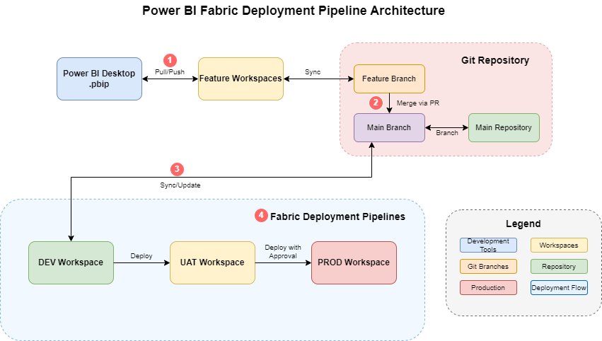
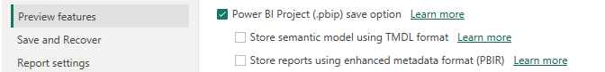
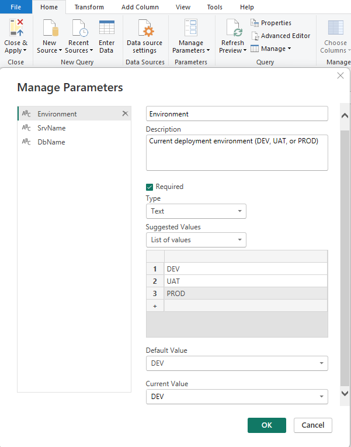
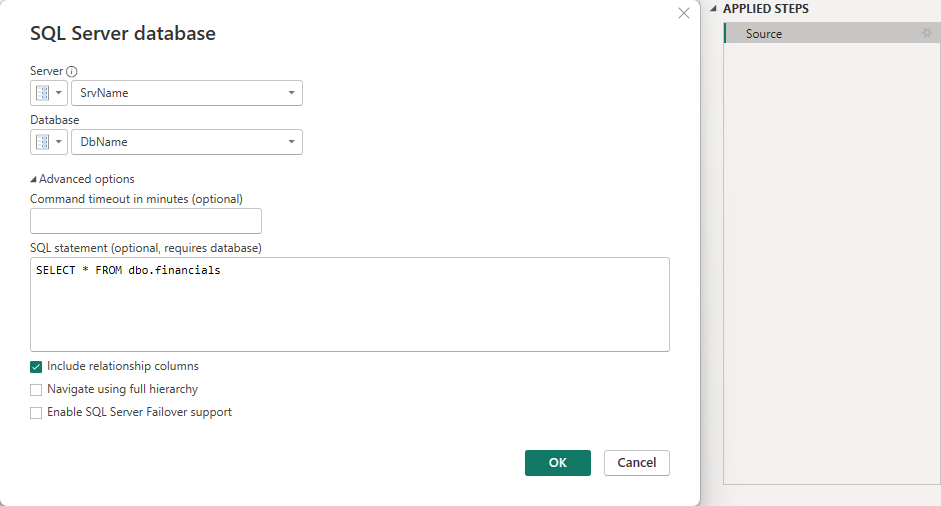

# Microsoft Fabric Git Integration & CI/CD Pipeline Reference Guide

## Power BI Reports Lifecycle Management

## Overview
This tutorial focuses specifically on implementing a complete CI/CD DevOps pipeline for **Power BI Reports** in Microsoft Fabric using Git integration and deployment pipelines. We'll cover the complete lifecycle management across three environments (DEV, UAT, PROD) with approval processes, including the essential Power BI Desktop configurations needed for seamless integration.

Development begins in dedicated feature workspaces, each connected to a corresponding feature branch in Git. After completing and testing changes in a feature workspace, you'll create a pull request to merge those changes into the main branch, which then triggers updates to the DEV environment and initiates the deployment pipeline.

## Architecture Overview - Option 3: Deploy using Fabric Deployment Pipelines

```
Power BI Desktop → Git Repository (Feature/Main Branches) → Fabric Deployment Pipelines

Development Flow:
1. Power BI Desktop ←→ Feature Workspaces (Pull/Push to Feature Branch)
2. Feature Branch → Main Branch (Merge via PR)
3. Main Branch → DEV Workspace (Sync/Update)
4. DEV → UAT → PROD (Deploy via Fabric Deployment Pipelines)
```

**Visual Architecture:**
<p align="center">
   
</p>

<p align="center">
   <strong>Figure: Power BI Desktop &rarr; Feature Workspaces &rarr; Git Branches &rarr; DEV/UAT/PROD Workspaces via Fabric Deployment Pipelines</strong>
</p>

<details>
   <summary>Textual Architecture Flow</summary>
   <pre>
[Power BI Desktop] ←Pull/Push→ [Feature Workspaces] ←Sync→ [Feature Branch]
                                                                                                   ↓ (Merge)
[DEV Workspace] ←Sync/Update→ [Main Branch] ←Branch→ [Main Repository]
         ↓ (Deploy)
[UAT Workspace] 
         ↓ (Deploy with Approval)
[PROD Workspace]
   </pre>
</details>
</br>

**Key Components:**
- **Feature Workspaces:** Connected to feature branches for development
- **Main DEV Workspace:** Connected to main branch, source for deployment pipeline
- **Git Repository:** Central version control with feature and main branches
- **Fabric Deployment Pipelines:** Native Fabric tool for DEV→UAT→PROD deployments
- **Trigger Deployment:** Automated or manual deployment initiation

## Part 1: Power BI Desktop Configuration for Power BI Projects (.pbip)

### Step 1: Power BI Desktop Settings Configuration

Before connecting your workspace to Git, you need to configure Power BI Desktop to support the new Git integration workflow and ensure optimal compatibility with Fabric's version control system.

#### 1.1 Enable Preview Features
1. **Open Power BI Desktop**
2. **Go to File → Options and Settings → Options**
3. **Navigate to Preview Features section**
4. **Enable the following preview feature (Essential for Power BI Projects):**

   **Required for Power BI Projects:**
   
   - ✅ **"Power BI Project (.pbip) save option"**
     - *REQUIRED: This enables saving reports in the new .pbip format*
     - *Essential for version control and Fabric workspace integration*
     - *Allows reports to be stored as decomposed files for better collaboration*

   <p align="center">
      
   </p>
   <p align="center">
   <strong>Figure: Power BI Desktop &rarr; Preview Features &rarr; Power BI Project (.pbip) Save Option</strong>
</p>

   > **📝 Note:**  
   > The options **"Store semantic model using TMDL format"** and **"Store reports using enhanced metadata format (PBIR)"** are visible in Power BI Desktop but cannot be enabled (checked).  
   >  
   > **⚠️ Important:**  
   > These options should remain unchecked because enabling them may cause compatibility issues with Fabric deployment pipelines. Always use the .pbip format for seamless integration and deployment pipeline compatibility.

5. **Restart Power BI Desktop** after enabling the Power BI Project preview feature

#### 1.2 Configure Data Source Settings
The data source configuration is done in **Power Query Editor**, not in the main Options menu. Here's where to configure it:

1. **Open Power BI Desktop**
2. **Click "Transform Data" to open Power Query Editor**
3. **In Power Query Editor, go to Home → Manage Parameters**

**Configure for Multi-Environment Support:**

**Step 1: Create Environment Parameter**
1. Click **"New"** to create a new parameter
2. Configure the Environment parameter:

```
Name: Environment
Description: Current deployment environment (DEV, UAT, or PROD)
Required: ✅ (Check the Required checkbox)
Type: Text (select from dropdown)
Suggested Values: List of values (select from dropdown)
  - Add: DEV
  - Add: UAT  
  - Add: PROD
Current Value: DEV
```

3. Click **OK** to save the Environment parameter

<p align="center">
      
   </p>
<p align="center">
   <strong>Figure: Power Query Editor &rarr; Manage Parameters &rarr; Environment Parameter</strong>
</p>

**Step 2: Create ServerName Parameter**
1. Click **"New"** again to create another parameter
2. Configure the ServerName parameter:

```
Name: SrvName
Description: Database server name based on environment
Required: ✅ (Check the Required checkbox)
Type: Text (select from dropdown)
Suggested Values: Any value (select from dropdown)
Current Value: dev-server-id.database.fabric.microsoft.com
```

3. Click **OK** to save the ServerName parameter

**Step 3: Create DatabaseName Parameter**
1. Click **"New"** for the third parameter
2. Configure the DatabaseName parameter:

```
Name: DbName
Description: Database name based on environment
Required: ✅ (Check the Required checkbox)
Type: Text (select from dropdown)
Suggested Values: Any value (select from dropdown)
Current Value: adventureworks-dev-workspace-id
```

3. Click **OK** to save the DatabaseName parameter

**How Environment Switching Actually Works:**

1. **Local Development:** Use DEV values in parameters
2. **Publish to DEV Workspace:** Parameters keep DEV values  
3. **Deploy DEV → UAT:** Fabric deployment pipeline automatically updates ServerName and DatabaseName parameters to UAT values
4. **Deploy UAT → PROD:** Fabric deployment pipeline automatically updates ServerName and DatabaseName parameters to PROD values

**Step 4: Configure Parameter Values for Each Environment**

When setting up your deployment pipeline, you'll configure parameter rules like this:

```
DEV Environment Parameters:
ServerName: dev-server-id.database.fabric.microsoft.com
DatabaseName: adventureworks-dev-workspace-id
Environment: DEV

UAT Environment Parameters:  
ServerName: uat-server-id.database.fabric.microsoft.com
DatabaseName: adventureworks-uat-workspace-id
Environment: UAT

PROD Environment Parameters:
ServerName: prod-server-id.database.fabric.microsoft.com  
DatabaseName: adventureworks-prod-workspace-id
Environment: PROD
```

**The deployment pipeline handles the parameter switching automatically - you don't need conditional logic in Power Query.**

**Step 5: Apply Parameters to Data Sources**
After creating simple parameters, connect them to your data source:

1. **Go to your data source query** (in Power Query Editor)
2. **Right-click on the Source step**
3. **Select "Edit Settings"** or click the gear icon
4. **Use your parameters in the connection:**
   - **Server:** Select `SrvName` parameter from dropdown
   - **Database:** Select `DbName` parameter from dropdown
   - **Authentication:** Choose **Microsoft account** or **Organizational account**

**Example Result:**
Your connection will look like:
```
Source = Sql.Database(SrvName, DbName)
```

<p align="center">
      
   </p>
<p align="center">
   <strong>Figure: Power Query Editor &rarr; Source step &rarr; Edit Settings</strong>
</p>  


### Step 2: Report Development Best Practices for Git

#### 2.1 File Organization in Power BI Desktop
When developing reports for Git integration:

1. **Use Consistent Naming Conventions:**
   ```
   Report Files:
   - [ProjectName]_[ReportType]_[Version].pbix
   - Example: SalesAnalytics_Dashboard_v1.0.pbix
   ```

2. **Separate Data Models and Reports:**
   - Create separate .pbix files for datasets
   - Create thin reports that connect to published datasets
   - Use shared datasets across multiple reports

3. **Parameter Management:**
   ```
   Create parameters for:
   - Environment URLs
   - Database connection strings  
   - API endpoints
   - Refresh schedules
   ```

#### 2.2 Dataset Configuration for Multi-Environment
1. **Create Environment Parameters:**
   ```
   Parameter Name: Environment
   Values: DEV, UAT, PROD
   
   Parameter Name: ServerName  
   Current Value: =switch([Environment], 
                         "DEV", "dev-sql-server.database.windows.net",
                         "UAT", "uat-sql-server.database.windows.net", 
                         "PROD", "prod-sql-server.database.windows.net")
   ```

2. **Configure Dynamic Data Sources:**
   - Use parameters in connection strings
   - Set up conditional refresh logic
   - Configure gateway connections per environment

### Step 3: Environment Parameters Configuration

#### 3.1 Create Environment Parameters for Multi-Environment Deployment
1. **In Power BI Desktop, go to Transform Data**
2. **Create the following parameters:**

   **Environment Parameter:**
   ```
   Parameter Name: Environment
   Type: Text
   Suggested Values: DEV, UAT, PROD
   Current Value: DEV
   Description: Current environment (DEV/UAT/PROD)
   ```

   **Server Name Parameter:**
   ```
   Parameter Name: ServerName
   Type: Text
   Current Value: =switch([Environment], 
                         "DEV", "dev-sql-server.database.windows.net",
                         "UAT", "uat-sql-server.database.windows.net", 
                         "PROD", "prod-sql-server.database.windows.net",
                         "dev-sql-server.database.windows.net")
   ```

   **Database Name Parameter:**
   ```
   Parameter Name: DatabaseName
   Type: Text  
   Current Value: =switch([Environment],
                         "DEV", "SalesDB_DEV",
                         "UAT", "SalesDB_UAT", 
                         "PROD", "SalesDB_PROD",
                         "SalesDB_DEV")
   ```

#### 3.2 Configure Dynamic Data Sources
1. **Update Data Source Connections:**
   - Edit data source queries
   - Replace hardcoded server/database names with parameters
   - Test connections with different parameter values

2. **Example SQL Server Connection:**
   ```sql
   Source = Sql.Database([ServerName], [DatabaseName])
   ```

3. **Example REST API Connection:**
   ```
   BaseURL Parameter: =switch([Environment],
                             "DEV", "https://api-dev.company.com",
                             "UAT", "https://api-uat.company.com", 
                             "PROD", "https://api.company.com",
                             "https://api-dev.company.com")
   ```

#### 3.3 Gateway Configuration per Environment
1. **Set up On-premises Data Gateway for each environment**
2. **Configure gateway connections:**
   - DEV Gateway: Points to development databases
   - UAT Gateway: Points to UAT databases  
   - PROD Gateway: Points to production databases

3. **Map data sources to appropriate gateways during deployment**

## Part 2: Microsoft Fabric Git Configuration for Power BI Reports

### Prerequisites
- Microsoft Fabric Premium or Trial capacity
- **Power BI Desktop (Latest Version)** with proper configuration
- GitHub repository
- Admin access to Fabric workspaces
- Power BI Premium Per User (PPU) or Premium capacity
- Understanding of Power BI report development lifecycle

### Step 1: Enable Git Integration in Fabric

#### 1.1 Tenant Settings Configuration
First, ensure Git integration is enabled at the tenant level:

1. Navigate to **Microsoft Fabric Admin Portal**
2. Go to **Tenant Settings**
3. Find **Git integration** section
4. Enable the following settings:

   **Core Git Integration Settings:**
   - ✅ **"Users can synchronize workspace items with their Git repositories"**
     - *Enabled for the entire organization*
     - Allows import and export of workspace items to Git repositories for collaboration and version control

   **GitHub-Specific Settings:**
   - ✅ **"Users can sync workspace items with GitHub repositories"**  
     - *Enabled for the entire organization*
     - Users can select GitHub as their Git provider and sync items in their workspaces with GitHub repositories

   **Workspace Management Settings:**
   - ✅ **"Create workspaces"**
     - *Enabled for the entire organization* 
     - Users can create app workspaces to collaborate on dashboards, reports, and other content

   **General Fabric Settings:**
   - ✅ **"Users can create Fabric items"**
     - *Enabled for the entire organization*
     - Users can use production-ready features to create Fabric items

> **Important:** All these settings should be enabled at the tenant level for the complete Git integration workflow to function properly. Without these enabled, users won't be able to connect workspaces to Git or perform sync operations.

#### 2.2 Workspace Structure for Option 3 Architecture
For the Fabric deployment pipelines approach, you'll need:

1. **Feature Development Workspaces (Multiple):**
   ```
   Workspace Names:
   - MyProject-Feature-Dashboard
   - MyProject-Feature-Reports  
   - MyProject-Feature-[FeatureName]
   ```
   - Connected to feature branches in Git
   - Used for individual feature development
   - Temporary workspaces that can be created/deleted

2. **Main Development Workspace:**
   ```
   Workspace Name: MyProject-DEV
   ```
   - Connected to main branch in Git
   - Source workspace for deployment pipeline
   - Integration point for all features

3. **Environment Workspaces:**
   ```
   Workspace Names:
   - MyProject-UAT (Test environment)
   - MyProject-PROD (Production environment)
   ```
   - Not directly connected to Git
   - Managed through Fabric deployment pipelines
   - Target workspaces for deployments

4. **Assign to Premium Capacity:**
   - All workspaces must be assigned to Premium capacity
   - Required for both Git integration and deployment pipelines

### Step 2: Connect DEV Workspace to GitHub

#### 2.1 Prepare GitHub Repository for Power BI Reports
1. Create a new GitHub repository or use existing one
2. **Power BI-focused repository structure:**
   ```
   my-powerbi-project/
   ├── .github/
   │   └── workflows/
   │       ├── dev-to-uat-reports.yml
   │       └── uat-to-prod-reports.yml
   ├── reports/
   │   ├── sales-dashboard/
   │   ├── financial-reporting/
   │   └── operational-metrics/
   ├── datasets/
   │   ├── sales-data-model/
   │   └── finance-data-model/
   ├── shared-resources/
   │   ├── themes/
   │   ├── templates/
   │   └── custom-visuals/
   ├── documentation/
   │   ├── report-specifications.md
   │   └── deployment-guide.md
   └── README.md
   ```

3. **Create environment-specific configuration files:**
   ```json
   // config/dev-config.json
   {
     "environment": "DEV",
     "workspace": "MyProject-DEV",
     "dataSourceSettings": {
       "serverName": "dev-sql-server.database.windows.net",
       "databaseName": "SalesDB_DEV"
     }
   }
   ```

#### 2.2 Connect Workspace to Git
1. **In your DEV Workspace:**
   - Click on **Workspace settings**
   - Select **Git integration** tab
   - Click **Connect to Git**

2. **Configure Git Connection:**
   ```
   Git provider: GitHub
   Organization: [your-github-org]
   Repository: [your-repo-name]
   Branch: main (or dev)
   Folder: / (root) or specify subfolder
   ```

3. **Authentication:**
   - You'll be redirected to GitHub for authentication
   - Grant necessary permissions to Microsoft Fabric

#### 2.3 Initial Sync
1. **Choose sync direction:**
   - **Workspace to Git:** If you have existing items in workspace
   - **Git to Workspace:** If starting from empty workspace

2. **Select items to sync:**
   - Choose which workspace items to include in Git
   - Recommended: Include all datasets, reports, and dataflows

### Step 3: Git Branch Strategy for Option 3

#### 3.1 Branch Structure for Fabric Deployment Pipelines
```
main (production-ready code) ← Connected to MyProject-DEV workspace
├── feature/sales-dashboard ← Connected to MyProject-Feature-Dashboard
├── feature/financial-reports ← Connected to MyProject-Feature-Reports  
├── feature/operational-metrics ← Connected to MyProject-Feature-Metrics
└── hotfix/critical-bug-fix ← Connected to MyProject-Hotfix workspace
```

#### 3.2 Workspace-to-Branch Mapping
```
Git Branch                    ↔ Fabric Workspace
─────────────────────────────────────────────────────
main                         ↔ MyProject-DEV (Pipeline Source)
feature/sales-dashboard      ↔ MyProject-Feature-Dashboard  
feature/financial-reports    ↔ MyProject-Feature-Reports
hotfix/critical-bug-fix      ↔ MyProject-Hotfix

Deployment Pipeline Flow:
MyProject-DEV → MyProject-UAT → MyProject-PROD
(No direct Git connection to UAT/PROD)
```

#### 3.3 Development Workflow
1. **Create Feature Branch & Workspace:**
   - Create feature branch from main
   - Create corresponding feature workspace
   - Connect workspace to feature branch

2. **Develop in Feature Environment:**
   - Publish reports to feature workspace from Power BI Desktop
   - Changes sync to feature branch automatically
   - Test and validate in isolated environment

3. **Merge to Main:**
   - Create Pull Request from feature branch to main
   - Code review and approval process
   - Merge triggers sync to DEV workspace

4. **Deploy via Fabric Pipelines:**
   - DEV workspace updates automatically from main branch
   - Use Fabric deployment pipelines to promote DEV → UAT → PROD
   - Each deployment stage can include approval gates

### Step 4: Configure Git Settings in Fabric

#### 4.1 Sync Settings
1. **Auto-sync configuration:**
   - Go to workspace Git integration settings
   - Configure sync frequency (manual vs automatic)
   - Set conflict resolution preferences

#### 4.2 File Types to Sync for Power BI Reports
   ```
   Supported Power BI items in Git:
   ✅ Power BI Reports (.pbir files)
   ✅ Power BI Datasets (.pbids files) 
   ✅ Dataflows (.json)
   ✅ Report metadata and settings
   ✅ Dataset parameters and connections
   ✅ Custom themes and templates
   
   Note: .pbix files are not directly synced - they're converted to 
   .pbir (reports) and .pbids (datasets) format for version control
   ```

#### 4.2 Collaboration Settings
1. **Permissions:**
   - Set who can commit changes
   - Configure approval requirements
   - Set up branch protection rules in GitHub

2. **Workspace Roles:**
   ```
   Admin: Full Git sync permissions
   Member: Can create branches, limited sync
   Contributor: Read-only Git access
   Viewer: No Git permissions
   ```

### Step 5: Git Operations for Power BI Reports

#### 5.1 Power BI Report Development Workflow
1. **Develop in Power BI Desktop:**
   - Create or modify reports locally
   - Test with development data sources
   - Validate report functionality

2. **Publish to DEV Workspace:**
   - Publish .pbix file to connected DEV workspace
   - Reports automatically convert to .pbir format
   - Datasets convert to .pbids format

3. **Sync Changes to Git:**
   - Navigate to Source control panel in Fabric
   - Review changes (new .pbir/.pbids files)
   - Add descriptive commit message:
     ```
     feat: Add new sales performance dashboard
     - Added quarterly sales trend visualization
     - Implemented drill-through functionality
     - Updated color scheme to match brand guidelines
     ```
   - Click **Commit** to sync to GitHub

#### 5.2 Monitoring Power BI Report Changes
Track changes through multiple interfaces:

- **Source control panel:** 
  - Shows modified .pbir files
  - Displays dataset parameter changes
  - Indicates new/deleted reports

- **Git integration tab:** 
  - Overall sync health status
  - Last successful sync timestamp
  - Sync error notifications

- **Activity log:** 
  - Detailed sync history
  - User who made changes
  - Specific files modified

#### 5.3 Handling Power BI Report Conflicts
When conflicts occur with Power BI reports:

1. **Report Layout Conflicts:**
   - Fabric attempts automatic merge for simple changes
   - Manual resolution required for complex layout changes
   - Use workspace version for visual formatting conflicts

2. **Dataset Schema Conflicts:**
   - Review data model changes carefully
   - Test data connections after resolution
   - Validate measure calculations

3. **Parameter Conflicts:**
   - Check environment-specific parameter values
   - Ensure connection strings are correct per environment
   - Validate refresh settings

## Part 3: Fabric Deployment Pipelines Configuration

### Step 1: Create Fabric Deployment Pipeline
1. **Navigate to Deployment Pipelines in Microsoft Fabric**
2. **Create new deployment pipeline:**
   ```
   Pipeline name: PowerBI-Reports-Lifecycle
   Description: Automated deployment from DEV to UAT to PROD
   Pipeline Type: Standard (3-stage pipeline)
   ```

### Step 2: Configure Three-Stage Pipeline
1. **Set up pipeline stages:**
   ```
   Stage 1: Development
   - Workspace: MyProject-DEV
   - Source: Connected to Git main branch
   - Role: Source workspace for all deployments
   
   Stage 2: Test  
   - Workspace: MyProject-UAT
   - Source: Deployed from Development stage
   - Role: User acceptance testing environment
   
   Stage 3: Production
   - Workspace: MyProject-PROD  
   - Source: Deployed from Test stage
   - Role: Live production environment
   ```

2. **Assign workspaces to stages:**
   - Development stage → MyProject-DEV (Git connected)
   - Test stage → MyProject-UAT (Pipeline managed)
   - Production stage → MyProject-PROD (Pipeline managed)

### Step 3: Configure Deployment Rules

#### 3.1 Content Selection Rules
1. **Select Power BI items to include:**
   - ✅ Power BI Reports (all .pbir files)
   - ✅ Power BI Datasets (all .pbids files)
   - ✅ Dataflows (if used)
   - ✅ Report metadata and themes

2. **Exclude items from deployment:**
   - ❌ Development-specific reports
   - ❌ Test datasets with sample data
   - ❌ Personal workspace items

#### 3.2 Parameter Mapping Rules
Configure automatic parameter updates during deployment:

```
Parameter Mapping Configuration:
─────────────────────────────────
Parameter Name: ServerName
DEV Value: dev-sql-server.database.windows.net
UAT Value: uat-sql-server.database.windows.net  
PROD Value: prod-sql-server.database.windows.net

Parameter Name: DatabaseName
DEV Value: SalesDB_DEV
UAT Value: SalesDB_UAT
PROD Value: SalesDB_PROD

Parameter Name: RefreshSchedule
DEV Value: Every 4 hours
UAT Value: Every 2 hours
PROD Value: Every hour
```

#### 3.3 Data Source Connection Rules
Set up automatic data source updates:

1. **SQL Server Connections:**
   ```
   Rule: Map DEV server connections
   From: dev-sql-server.database.windows.net
   To (UAT): uat-sql-server.database.windows.net
   To (PROD): prod-sql-server.database.windows.net
   ```

2. **API Endpoint Mappings:**
   ```
   Rule: Update API URLs per environment
   From: https://api-dev.company.com
   To (UAT): https://api-uat.company.com
   To (PROD): https://api.company.com
   ```

### Step 4: Configure Approval Gates

#### 4.1 UAT Deployment Approval
1. **Set up approval for DEV → UAT:**
   ```
   Approval Type: Manual approval required
   Approvers: UAT Testing Team, Business Users
   Approval Criteria:
   - Functional testing completed
   - Data validation passed
   - Performance testing approved
   ```

2. **Configure approval notifications:**
   - Email notifications to approvers
   - Teams/Slack integration for alerts
   - Deployment summary with changes

#### 4.2 PROD Deployment Approval  
1. **Set up approval for UAT → PROD:**
   ```
   Approval Type: Multi-stage approval
   Primary Approvers: Product Owner, Technical Lead
   Secondary Approvers: IT Operations, Data Governance
   Approval Criteria:
   - UAT sign-off completed
   - Security review passed
   - Change management approval
   - Scheduled deployment window
   ```

### Step 5: Trigger Deployment Process

#### 5.1 Automated Trigger Configuration
1. **DEV Workspace Updates:**
   ```
   Trigger: Git sync to main branch
   Action: Automatic update of DEV workspace
   Notification: Teams channel notification
   ```

2. **Pipeline Deployment Triggers:**
   ```
   DEV → UAT: Manual trigger after Git sync
   UAT → PROD: Manual trigger after UAT approval
   ```

#### 5.2 Manual Deployment Process
1. **Initiate DEV → UAT Deployment:**
   - Navigate to deployment pipeline
   - Click "Deploy" from Development to Test stage
   - Review deployment summary
   - Submit for approval

2. **Approval Workflow:**
   - Approvers receive notification
   - Review changes and test results
   - Approve or reject with comments
   - Automatic deployment on approval

3. **Monitor Deployment:**
   - Real-time deployment status
   - Error notifications and logs
   - Rollback options if needed

## Part 4: Complete Workflow Implementation

### Step 1: Feature Development Workflow

#### 1.1 Starting New Feature Development
1. **Create Feature Branch:**
   ```bash
   git checkout main
   git pull origin main
   git checkout -b feature/sales-performance-dashboard
   git push -u origin feature/sales-performance-dashboard
   ```

2. **Create Feature Workspace:**
   - Create new workspace: "MyProject-Feature-SalesPerformance"
   - Assign to Premium capacity
   - Connect to feature branch in Git

3. **Develop in Power BI Desktop:**
   - Create/modify reports locally
   - Test with development data
   - Publish to feature workspace

4. **Sync to Feature Branch:**
   - Changes automatically sync to Git feature branch
   - Regular commits with descriptive messages
   - Collaborate with team members on feature

#### 1.2 Integration and Merge Process
1. **Create Pull Request:**
   - From feature branch to main branch
   - Include description of changes
   - Add reviewers and approval requirements

2. **Code Review Process:**
   - Review Power BI report changes (.pbir files)
   - Validate dataset modifications (.pbids files)
   - Check parameter configurations
   - Approve and merge to main

3. **Automatic DEV Update:**
   - Main branch sync triggers DEV workspace update
   - DEV workspace reflects merged changes
   - Ready for deployment pipeline

### Step 2: Deployment Pipeline Execution

#### 2.1 DEV to UAT Deployment
1. **Initiate Deployment:**
   - Navigate to Fabric Deployment Pipeline
   - Select "Deploy" from Development to Test stage
   - Review deployment summary showing:
     - Modified reports
     - Updated datasets  
     - Parameter changes
     - Data source mappings

2. **Automatic Configuration:**
   ```
   During DEV → UAT deployment:
   - Server connections updated automatically
   - Environment parameters mapped
   - Refresh schedules adjusted
   - Security settings applied
   ```

3. **UAT Testing Process:**
   - Business users test in UAT environment
   - Validate report functionality
   - Verify data accuracy
   - Performance testing
   - User acceptance sign-off

#### 2.2 UAT to PROD Deployment
1. **Production Deployment Request:**
   - Submit UAT → PROD deployment request
   - Include UAT testing results
   - Specify deployment window
   - Add business justification

2. **Approval Workflow:**
   ```
   Approval Chain:
   1. Business Owner approval
   2. Technical Lead approval  
   3. IT Operations approval
   4. Data Governance approval (if data changes)
   ```

3. **Scheduled Production Deployment:**
   - Deploy during maintenance window
   - Monitor deployment progress
   - Validate post-deployment functionality
   - Notify stakeholders of completion

### Step 3: Monitoring and Maintenance

#### 3.1 Deployment Monitoring
1. **Real-time Monitoring:**
   - Deployment pipeline status dashboard
   - Error notifications and alerts
   - Performance metrics tracking
   - User access monitoring

2. **Post-Deployment Validation:**
   - Automated report refresh testing
   - Data quality validation
   - User access verification
   - Performance benchmarking

#### 3.2 Rollback Procedures
1. **Emergency Rollback:**
   - Quick rollback to previous version
   - Automated via deployment pipeline
   - Minimal downtime procedures

2. **Rollback Process:**
   ```
   Rollback Steps:
   1. Identify issue in PROD
   2. Initiate emergency rollback
   3. Deploy previous stable version
   4. Validate rollback success
   5. Investigate and fix issue in lower environments
   ```

## Part 5: Advanced Configuration and Best Practices

### Step 1: Fabric CLI Integration

#### 1.1 Install and Configure Fabric CLI
```bash
# Install Fabric CLI
pip install fabric-cli

# Authenticate with Fabric
fabric auth login

# List workspaces
fabric workspace list

# Deploy specific items
fabric deploy --source-workspace "MyProject-DEV" --target-workspace "MyProject-UAT"
```

#### 1.2 Automated Scripts for Deployment
```python
# deployment-script.py
from fabric_cli import FabricClient
import json

def deploy_reports(source_workspace, target_workspace):
    client = FabricClient()
    
    # Get reports from source
    reports = client.get_reports(source_workspace)
    
    # Deploy each report
    for report in reports:
        client.deploy_report(
            report_id=report['id'],
            source_workspace=source_workspace,
            target_workspace=target_workspace,
            update_parameters=True
        )
    
    print(f"Deployed {len(reports)} reports from {source_workspace} to {target_workspace}")

# Usage
deploy_reports("MyProject-DEV", "MyProject-UAT")
```

### Step 2: REST API Integration

#### 2.1 Fabric REST API for Deployment
```python
import requests
import json

class FabricAPIClient:
    def __init__(self, access_token):
        self.base_url = "https://api.fabric.microsoft.com/v1"
        self.headers = {
            "Authorization": f"Bearer {access_token}",
            "Content-Type": "application/json"
        }
    
    def trigger_deployment(self, pipeline_id, source_stage_id, target_stage_id):
        url = f"{self.base_url}/pipelines/{pipeline_id}/deploy"
        payload = {
            "sourceStageOrder": source_stage_id,
            "targetStageOrder": target_stage_id,
            "options": {
                "allowCreateArtifact": True,
                "allowOverwriteArtifact": True
            }
        }
        
        response = requests.post(url, headers=self.headers, json=payload)
        return response.json()
    
    def get_deployment_status(self, operation_id):
        url = f"{self.base_url}/operations/{operation_id}"
        response = requests.get(url, headers=self.headers)
        return response.json()

# Usage example
client = FabricAPIClient(access_token="your_token_here")
deployment = client.trigger_deployment(
    pipeline_id="your_pipeline_id",
    source_stage_id=0,  # DEV
    target_stage_id=1   # UAT
)
```

### Step 3: Best Practices and Troubleshooting

#### 3.1 Development Best Practices
1. **Git Commit Standards:**
   ```
   Commit Message Format:
   feat: Add new sales dashboard with drill-through functionality
   fix: Resolve data refresh issue in financial reports
   docs: Update deployment documentation
   refactor: Optimize data model for better performance
   ```

2. **Power BI Report Standards:**
   - Use consistent naming conventions
   - Implement proper error handling
   - Document custom measures and calculations
   - Follow accessibility guidelines
   - Optimize for performance

3. **Environment Management:**
   - Keep environments synchronized
   - Regular testing in UAT before PROD
   - Monitor resource usage and performance
   - Implement proper security and access controls

#### 3.2 Common Issues and Solutions

1. **Git Sync Issues:**
   ```
   Issue: Sync failures between workspace and Git
   Solution: 
   - Check workspace Premium capacity assignment
   - Verify Git permissions and authentication
   - Review file size limitations
   - Clear workspace cache if needed
   ```

2. **Deployment Pipeline Failures:**
   ```
   Issue: Deployment fails between stages
   Solution:
   - Verify parameter mapping configuration
   - Check data source connection rules
   - Validate workspace permissions
   - Review deployment logs for specific errors
   ```

3. **Performance Issues:**
   ```
   Issue: Slow report performance in higher environments
   Solution:
   - Optimize data model and relationships
   - Implement incremental refresh
   - Review and optimize DAX measures
   - Configure appropriate refresh schedules
   ```

## Summary

This tutorial covered the complete implementation of **Option 3: Deploy using Fabric deployment pipelines** for Power BI reports lifecycle management. The architecture provides:

✅ **Git Integration:** Feature branches connected to development workspaces
✅ **Automated Deployment:** Fabric native deployment pipelines  
✅ **Approval Gates:** Multi-stage approval process for production deployments
✅ **Environment Management:** Automatic parameter and connection updates
✅ **Monitoring:** Real-time deployment tracking and rollback capabilities

**Next Steps:**
- Implement the Power BI Desktop configurations
- Set up your Git repository with the recommended structure
- Create and configure the Fabric deployment pipeline
- Test the complete workflow with a sample report
- Train your team on the new development and deployment process